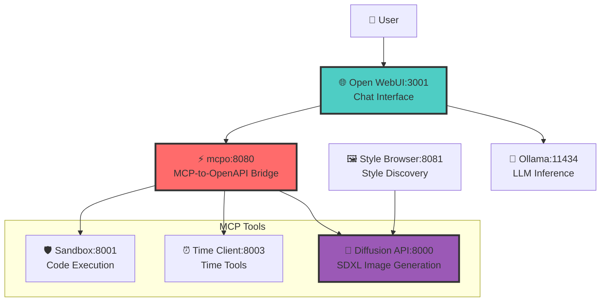

# MCP Tools for Open WebUI

A streamlined Model Context Protocol (MCP) implementation designed for seamless integration with [Open WebUI](https://openwebui.com) via [mcpo proxy](https://github.com/open-webui/mcpo). This project provides secure code execution and time tools accessible through a beautiful chat interface.

## 🎯 **What This Does**

Transform your AI chat into a powerful development environment:
- **💬 Natural Language**: Ask AI to run code, check time, install packages
- **🛡️ Secure Execution**: Sandboxed Python environment with safety controls
- **🔧 Easy Integration**: One-command deployment with Docker Compose
- **📊 Full Observability**: Prometheus metrics + Grafana dashboards

## ⚡ **Quick Demo**

After setup, you can chat with AI like this:
- *"What time is it right now?"* → Gets current UTC time
- *"Calculate fibonacci(10) in Python"* → Executes code safely
- *"Install requests and fetch httpbin.org/json"* → Installs packages and runs code

## 🏗️ **Architecture Overview**

The system uses **mcpo** to bridge MCP tools with Open WebUI's OpenAPI interface:

### **Core Services**
- **🌐 Open WebUI** (Port 3001): Modern chat interface with tool integration
- **⚡ mcpo** (Port 8080): MCP-to-OpenAPI proxy bridge  
- **🛡️ Sandbox** (Port 8001): Secure Python code execution environment
- **⏰ Time Client** (Port 8003): Time-related MCP tools
- **🎨 Diffusion API** (Port 8000): SDXL image generation with style support
- **🖼️ Style Browser** (Port 8081): Interactive style discovery interface
- **🤖 Ollama** (Port 11434): Local LLM inference with GPU acceleration

### **Infrastructure Services**
- **📊 Prometheus** (Port 9090): Metrics collection
- **📈 Grafana** (Port 3000): Visualization dashboards



### 📖 **Component Documentation**
Each component has detailed documentation with setup instructions, API specifications, and troubleshooting guides:

- **[🛡️ Sandbox Service](sandbox/README.md)** - Secure Python code execution environment
- **[⏰ Time Client](time-client/README.md)** - Time and timezone management service  
- **[🎨 Diffusion API](diffusion-api/README.md)** - SDXL image generation with 200+ artistic styles
- **[🌐 Style Browser](style-browser/README.md)** - Interactive web interface for style discovery
- **[📊 Monitoring Stack](monitoring/README.md)** - Prometheus & Grafana observability solution

## 🚀 **Quick Start**

### Prerequisites
- Docker and Docker Compose
- Git
- NVIDIA GPU (optional, for Ollama acceleration)

### Installation

```bash
# Clone the repository
git clone <repository-url>
cd mcp_things2

# Create data directories for persistent storage
mkdir -p data/grafana data/prometheus data/open-webui

# Start all services
docker-compose up --build
```

### 🎉 **Access Your Tools**

Once running, visit these URLs:

| Service | URL | Purpose |
|---------|-----|---------|
| **Open WebUI** | http://localhost:3001 | 💬 **Main chat interface** |
| **Style Browser** | http://localhost:8081 | 🎨 **Browse SDXL styles** |
| mcpo Proxy | http://localhost:8080 | ⚡ Tool API gateway |
| Time Tools Docs | http://localhost:8080/time/docs | ⏰ Interactive API docs |
| Sandbox Tools Docs | http://localhost:8080/sandbox/docs | 🛡️ Code execution docs |
| Diffusion API Docs | http://localhost:8000/docs | 🎨 Image generation API |
| Ollama | http://localhost:11434 | 🤖 LLM inference |
| Prometheus | http://localhost:9090 | 📊 Metrics collection |
| Grafana | http://localhost:3000 | 📈 Dashboards (admin/admin) |

## 🛠️ **Available Tools**

### ⏰ **Time Tools**
- **`get_current_time`**: Returns current UTC time in formatted string
- **Access**: Available in chat or at `http://localhost:8080/time/docs`

### 🛡️ **Code Execution Tools** 
- **`execute_python`**: Execute Python code in secure sandbox environment
- **`pip_install`**: Install Python packages with security validation
- **Access**: Available in chat or at `http://localhost:8080/sandbox/docs`

### 🎨 **Image Generation Tools**
- **`generate_images`**: Create AI images with SDXL using optional style templates
- **`list_styles`**: Browse hundreds of available artistic styles
- **`suggest_styles`**: Get AI-suggested styles based on your description
- **`get_style`**: Get details about a specific style
- **Style Browser**: Interactive web interface at `http://localhost:8081`
- **Access**: Available in chat or at `http://localhost:8000/docs`

### 🔒 **Security Features**
- Container isolation for all code execution
- Package name validation and blocklist
- Suspicious package detection and blocking
- Non-root execution environment
- Timeout protection and resource limits

## 💬 **Using the Chat Interface**

Simply open http://localhost:3001 and start chatting! Examples:

**Time Queries:**
- "What time is it?"
- "Show me the current UTC time"

**Code Execution:**
- "Calculate the factorial of 8 in Python"
- "Create a list of prime numbers up to 50"
- "Show me a simple matplotlib plot"

**Package Management:**
- "Install the requests library"
- "Install numpy and create a random array"
- "Use pandas to create a DataFrame"

**Image Generation:**
- "Generate an image of a sunset over mountains"
- "Create a cinematic style image of a cyberpunk city"
- "What artistic styles are available for image generation?"
- "Suggest some styles for creating fantasy artwork"
- "Generate a portrait in the Fooocus Photograph style"

## 🔧 **Direct API Usage**

You can also call tools directly via the mcpo API:

```bash
# Get current time
curl -X GET "http://localhost:8080/time/get_current_time" \
  -H "Authorization: Bearer your-secret-key"

# Execute Python code
curl -X POST "http://localhost:8080/sandbox/execute" \
  -H "Authorization: Bearer your-secret-key" \
  -H "Content-Type: application/json" \
  -d '{"code": "print(\"Hello, MCP World!\")"}'

# Install a package
curl -X POST "http://localhost:8080/sandbox/pip_install" \
  -H "Authorization: Bearer your-secret-key" \
  -H "Content-Type: application/json" \
  -d '{"package": "requests", "version": "latest"}'
```

## 🏗️ **Project Structure**

```
mcp_things2/
├── docker-compose.yml          # Service orchestration
├── mcpo-config.json           # mcpo tool configuration
├── sandbox/                   # Secure code execution
│   ├── app/main.py           # Sandbox FastAPI-MCP service
│   ├── requirements.txt      # Python dependencies
│   └── Dockerfile           # Container definition
├── time-client/              # Time tools
│   ├── app/main.py          # Time FastAPI-MCP service
│   ├── requirements.txt     # Python dependencies  
│   └── Dockerfile          # Container definition
├── data/                    # Persistent data (host mounts)
│   ├── grafana/            # Grafana dashboards and data
│   ├── prometheus/         # Prometheus metrics data
│   └── open-webui/         # Open WebUI user data
├── monitoring/             # Monitoring configuration
│   ├── prometheus.yml      # Prometheus scrape config
│   └── grafana/           # Grafana provisioning
└── workspace/             # Shared workspace volume
```

## ⚙️ **Configuration**

### mcpo Configuration
The `mcpo-config.json` file defines which MCP services to expose:

```json
{
  "mcpServers": {
    "time": {
      "type": "sse",
      "url": "http://time-client:8003/mcp/sse"
    },
    "sandbox": {
      "type": "sse", 
      "url": "http://sandbox:8001/mcp/sse"
    }
  }
}
```

### Environment Variables
Key configuration options:

**Open WebUI:**
- `OPENAI_API_BASE_URL=http://ollama:11434/v1`
- `OPENAI_API_KEY=ollama`
- `ENABLE_OPENAI_API=true`

**mcpo:**
- API key configured in docker-compose.yml
- Port and config file path

**Ollama:**
- Automatic GPU detection if available
- Models stored in `~/docker-data/ollama`

### Ollama Model Management
```bash
# Pull models via Ollama service
docker-compose exec ollama ollama pull llama3.1:latest
docker-compose exec ollama ollama list
docker-compose exec ollama ollama show llama3.1:latest
```

## 📊 **Monitoring & Health**

### Health Checks
```bash
# Check all services
curl http://localhost:3001/health   # Open WebUI
curl http://localhost:8080/health   # mcpo
curl http://localhost:8001/health   # Sandbox
curl http://localhost:8003/health   # Time Client
curl http://localhost:11434/api/tags # Ollama
```

### Metrics & Dashboards
- **Prometheus**: Collects metrics from all services
- **Grafana**: Provides pre-configured dashboards
- **Service Health**: Automatic dependency monitoring
- **Tool Usage**: Track tool calls and execution times

## 🛡️ **Security Considerations**

### Code Execution Security
- **Container Isolation**: Each execution runs in isolated environment
- **Package Validation**: Blocks known malicious packages
- **Resource Limits**: CPU, memory, and time constraints
- **Non-root Execution**: All code runs as non-privileged user
- **Network Controls**: Limited external network access

### API Security
- **Authentication**: API key required for mcpo access
- **Input Validation**: All inputs sanitized and validated
- **Rate Limiting**: Protection against abuse
- **CORS Configuration**: Controlled cross-origin access

## 🚢 **Development & Deployment**

### Development Workflow
```bash
# Start in development mode
docker-compose up --build

# View logs
docker-compose logs -f sandbox
docker-compose logs -f time-client

# Rebuild specific service
docker-compose build sandbox
docker-compose up -d sandbox

# Access container for debugging
docker-compose exec sandbox bash
```

### Adding New Tools
1. Create new FastAPI-MCP service
2. Add service to `docker-compose.yml`
3. Update `mcpo-config.json` with new endpoint
4. Restart mcpo to load new tools

### Production Deployment
- Use environment-specific compose files
- Configure secrets management
- Set up proper logging and monitoring
- Consider Kubernetes for larger deployments

## 🔮 **Roadmap**

See [IDEAS.md](IDEAS.md) for planned features:
- Additional tool integrations (Jira, Mattermost, etc.)
- Enhanced security controls
- Multi-user support
- Custom model integrations
- Advanced monitoring and alerting

## 🤝 **Contributing**

1. Fork the repository
2. Create a feature branch
3. Make your changes
4. Test with the Docker Compose setup
5. Submit a pull request

## 📖 **Documentation**

For more details, see:
- [Sequence Diagrams](sequence_diagram.md) - Detailed interaction flows
- [Architecture Overview](mcp_architecture.md) - Deep dive into design
- [Docker Patterns](docker-build-pattern.md) - Container best practices
- [Development Ideas](IDEAS.md) - Future enhancements

## 📄 **License**

MIT License - see LICENSE file for details.

---

**Built with ❤️ using [Model Context Protocol](https://modelcontextprotocol.io), [Open WebUI](https://openwebui.com), and [mcpo](https://github.com/open-webui/mcpo)** 