# 🎨 Diffusion API Service

A powerful SDXL (Stable Diffusion XL) image generation service with extensive style support and MCP (Model Context Protocol) integration for AI assistants.

## 🎯 Purpose

The Diffusion API service provides AI assistants with advanced image generation capabilities using SDXL models. It features hundreds of artistic styles, smart style suggestions, and seamless integration through the MCP protocol, making AI-powered image creation accessible through natural language conversations.

## 🏗️ Architecture

```mermaid
graph TB
    AI[🤖 AI Assistant] 
    mcpo[⚡ mcpo Proxy]
    FastAPIMCP[📡 FastAPI-MCP Server]
    
    subgraph "Diffusion API Container"
        API[🔌 FastAPI App]
        StyleEngine[🎨 Style Engine]
        ModelManager[🧠 Model Manager]
        Generator[⚡ Image Generator]
        Scheduler[⏰ Scheduler]
    end
    
    subgraph "Resources"
        SDXLModel[🤖 SDXL Model]
        StyleDB[📚 Style Database]
        GPU[🚀 GPU/CUDA]
    end
    
    AI --> mcpo
    mcpo --> FastAPIMCP
    FastAPIMCP --> API
    API --> StyleEngine
    API --> ModelManager
    ModelManager --> Generator
    Generator --> Scheduler
    ModelManager --> SDXLModel
    StyleEngine --> StyleDB
    Generator --> GPU
```



## ⚡ Features

### 🔧 **Core Capabilities**
- **SDXL Image Generation**: High-quality 1024x1024 image generation
- **Style System**: 200+ artistic styles with smart suggestions
- **MCP Integration**: Native Model Context Protocol support
- **GPU Acceleration**: CUDA support for fast generation
- **Flexible Parameters**: Control steps, guidance, seeds, and more

### 🎨 **Style Features**
- **Extensive Style Library**: 200+ pre-configured artistic styles
- **Smart Suggestions**: AI-powered style recommendations based on prompts
- **Style Categories**: Photography, Digital Art, Traditional Art, Cinematic, etc.
- **Prompt Templates**: Styles include optimized prompt templates
- **Dynamic Style Loading**: Hot-reload styles without service restart

### 🚀 **Performance Features**
- **Optimized Pipeline**: Efficient SDXL pipeline implementation
- **Memory Management**: Smart GPU memory handling
- **Batch Processing**: Support for multiple image generation
- **Caching**: Model and style caching for faster response

## 📡 API Endpoints

### **MCP Endpoints**
- `GET /mcp/sse` - Server-Sent Events MCP connection
- `POST /mcp` - Direct MCP tool calls

### **Direct FastAPI Endpoints**
- `POST /v1/generate` - Generate images with optional styles
- `GET /v1/styles` - List all available styles
- `GET /v1/styles/{name}` - Get specific style details
- `POST /v1/styles/suggest` - Get style suggestions for prompts
- `GET /health` - Health check
- `GET /docs` - Interactive API documentation

## 🔧 Tool Specifications

### `generate_image`
Generates high-quality images using SDXL with optional style application.

**Parameters:**
- `prompt` (string, required): Text description of the desired image
- `style_name` (string, optional): Name of artistic style to apply
- `negative_prompt` (string, optional): Text to avoid in generation
- `steps` (integer, optional): Number of denoising steps (10-50, default: 20)
- `guidance_scale` (float, optional): CFG scale (1.0-20.0, default: 7.5)
- `seed` (integer, optional): Random seed for reproducibility
- `width` (integer, optional): Image width (default: 1024)
- `height` (integer, optional): Image height (default: 1024)

**Returns:**
- `image_data`: Base64-encoded PNG image
- `prompt_used`: Final prompt sent to model (with style applied)
- `style_applied`: Name of style used (if any)
- `generation_time`: Time taken to generate
- `seed_used`: Seed value used for generation
- `parameters`: Full generation parameters

**Example:**
```python
{
  "prompt": "A majestic dragon flying over a crystal lake",
  "style_name": "fantasy_art",
  "steps": 25,
  "guidance_scale": 8.0
}
```

### `list_styles`
Returns a list of all available artistic styles with metadata.

**Parameters:**
- `category` (string, optional): Filter by style category
- `search` (string, optional): Search in style names and descriptions

**Returns:**
- `styles`: List of style objects with name, description, category
- `total_count`: Total number of matching styles
- `categories`: Available style categories

### `get_style`
Retrieves detailed information about a specific style.

**Parameters:**
- `name` (string, required): Exact name of the style

**Returns:**
- `style`: Complete style object with template, tags, etc.
- `examples`: Example prompts that work well with this style
- `similar_styles`: Recommended similar styles

### `suggest_styles`
Provides AI-powered style suggestions based on prompt analysis.

**Parameters:**
- `prompt` (string, required): The prompt to analyze
- `max_suggestions` (integer, optional): Maximum suggestions to return (default: 3)

**Returns:**
- `suggestions`: List of suggested styles with confidence scores
- `reasoning`: Why each style was suggested
- `prompt_analysis`: Keywords and themes detected in prompt

## 🎨 Style System

### Style Categories
- **📸 Photography**: portrait, landscape, macro, street, etc.
- **🎭 Digital Art**: cyberpunk, fantasy, sci-fi, concept art
- **🖼️ Traditional Art**: oil painting, watercolor, pencil sketch
- **🎬 Cinematic**: film noir, action movie, horror, romance
- **🌟 Artistic Movements**: impressionism, surrealism, abstract
- **📺 Animation**: anime, cartoon, 3D render, pixel art

### Style Format
Each style includes:
```json
{
  "name": "fantasy_art",
  "prompt": "fantasy art, {prompt}, magical, ethereal, detailed",
  "negative_prompt": "blurry, low quality, text, watermark",
  "category": "Digital Art",
  "description": "Epic fantasy artwork with magical elements",
  "tags": ["fantasy", "magical", "detailed", "artistic"],
  "source_file": "digital_art.json"
}
```

### Smart Style Suggestions
The suggestion algorithm analyzes prompts for:
- **Visual Elements**: objects, scenes, characters
- **Mood Keywords**: dark, bright, mysterious, cheerful
- **Technical Terms**: macro, portrait, landscape
- **Artistic References**: painting, photography, digital art
- **Genre Indicators**: fantasy, sci-fi, horror, romance

## 🚀 Usage Examples

### Through MCP (AI Assistant)
```
User: "Generate an image of a sunset over mountains"
AI: Uses generate_image tool → Creates beautiful sunset landscape

User: "Make it look like an oil painting"
AI: Uses suggest_styles with "oil painting sunset mountains" → 
     Applies "oil_painting" style → Generates artistic version

User: "Show me all photography styles"
AI: Uses list_styles with category="Photography" → 
     Lists portrait, landscape, macro, street styles

User: "What styles work well with 'cyberpunk city'?"
AI: Uses suggest_styles → Recommends cyberpunk, neon, sci-fi styles
```

### Direct API Calls
```bash
# Generate image without style
curl -X POST "http://localhost:8004/v1/generate" \
  -H "Content-Type: application/json" \
  -d '{
    "prompt": "A peaceful garden with cherry blossoms",
    "steps": 25
  }'

# Generate with specific style
curl -X POST "http://localhost:8004/v1/generate" \
  -H "Content-Type: application/json" \
  -d '{
    "prompt": "A peaceful garden",
    "style_name": "watercolor_painting",
    "steps": 30
  }'

# Get style suggestions
curl -X POST "http://localhost:8004/v1/styles/suggest" \
  -H "Content-Type: application/json" \
  -d '{
    "prompt": "mysterious dark forest",
    "max_suggestions": 5
  }'

# List styles by category
curl "http://localhost:8004/v1/styles?category=Photography"
```

## 🛠️ Configuration

### Environment Variables
- `MODEL_PATH=/app/models` - Path to SDXL model files
- `STYLES_PATH=/app/sdxl_styles` - Path to style JSON files
- `DEVICE=cuda` - Device to use (cuda/cpu)
- `MAX_BATCH_SIZE=4` - Maximum batch size for generation
- `CACHE_SIZE=2` - Number of models to keep in memory
- `DEFAULT_STEPS=20` - Default denoising steps
- `DEFAULT_GUIDANCE=7.5` - Default guidance scale

### Model Configuration
```python
# SDXL Pipeline settings
SDXL_MODEL_ID = "stabilityai/stable-diffusion-xl-base-1.0"
SCHEDULER_TYPE = "DPMSolverMultistepScheduler"
TORCH_DTYPE = torch.float16  # For GPU efficiency
ENABLE_ATTENTION_SLICING = True
ENABLE_CPU_OFFLOAD = False  # Set True for low VRAM
```

### Style Loading
Styles are loaded from JSON files in the `sdxl_styles/` directory:
- `photography.json` - Photography styles
- `digital_art.json` - Digital art styles
- `traditional_art.json` - Traditional art styles
- `cinematic.json` - Cinematic styles
- `anime.json` - Anime and animation styles

## 📦 Dependencies

```txt
fastapi==0.104.1
fastapi-mcp==0.2.0
uvicorn==0.24.0
torch>=2.0.0
diffusers>=0.21.0
transformers>=4.25.0
accelerate>=0.20.0
pillow>=9.0.0
numpy>=1.21.0
```

### GPU Requirements
- **VRAM**: Minimum 8GB for SDXL generation
- **CUDA**: Compatible NVIDIA GPU with CUDA 11.8+
- **Driver**: NVIDIA driver 520+ recommended

## 🔧 Development

### Local Setup
```bash
cd diffusion-api/

# Create virtual environment
python -m venv venv
source venv/bin/activate  # Linux/Mac
# or: venv\Scripts\activate  # Windows

# Install dependencies
pip install -r requirements.txt

# Download SDXL model (first run)
python -c "from diffusers import DiffusionPipeline; DiffusionPipeline.from_pretrained('stabilityai/stable-diffusion-xl-base-1.0')"

# Run the service
python app/main.py
```

### Docker Setup
```bash
# Build image
docker build -t diffusion-api:latest .

# Run with GPU support
docker run --gpus all -p 8004:8004 \
  -v ./models:/app/models \
  -v ./sdxl_styles:/app/sdxl_styles \
  diffusion-api:latest
```

### Testing
```bash
# Test health endpoint
curl http://localhost:8004/health

# Test basic generation
curl -X POST http://localhost:8004/v1/generate \
  -H "Content-Type: application/json" \
  -d '{"prompt": "test image", "steps": 10}'

# Test style listing
curl http://localhost:8004/v1/styles

# Test MCP integration
curl http://localhost:8004/mcp/sse
```

## 🔍 Monitoring & Logging

### Health Checks
The service provides comprehensive health monitoring:
- GPU availability and memory usage
- Model loading status
- Style database validation
- Generation pipeline health

### Logging
```python
# Generation logging
logger.info(f"Generating image: {prompt[:50]}...")
logger.info(f"Using style: {style_name}")
logger.info(f"Generation completed in {time:.2f}s")

# Performance logging
logger.info(f"GPU memory: {gpu_memory_used}GB / {gpu_memory_total}GB")
logger.warning(f"High GPU utilization: {gpu_utilization}%")

# Error logging
logger.error(f"Generation failed: {error}")
logger.warning(f"Style not found: {style_name}")
```

### Metrics (Prometheus)
- `diffusion_generations_total` - Total image generations by style
- `diffusion_generation_duration_seconds` - Generation time histogram
- `diffusion_gpu_memory_usage_bytes` - GPU memory usage
- `diffusion_style_usage_total` - Style usage statistics
- `diffusion_errors_total` - Error counter by type

## 🎨 Style Management

### Adding New Styles
1. Create or edit style JSON files in `sdxl_styles/`
2. Follow the style format specification
3. Restart service or trigger hot-reload
4. Test new styles through API

### Style Best Practices
- **Prompt Templates**: Use `{prompt}` placeholder for user input
- **Negative Prompts**: Include quality-improving negative prompts
- **Keywords**: Add descriptive tags for better suggestions
- **Categories**: Group related styles together

### Custom Style Example
```json
{
  "name": "my_custom_style",
  "prompt": "custom art style, {prompt}, highly detailed, professional",
  "negative_prompt": "blurry, low quality, amateur, text",
  "category": "Custom",
  "description": "My personalized art style",
  "tags": ["custom", "detailed", "professional"],
  "source_file": "custom.json"
}
```

## 🔧 Troubleshooting

### Common Issues

**CUDA/GPU Issues:**
```bash
# Check GPU availability
nvidia-smi

# Check CUDA in container
docker run --gpus all diffusion-api:latest python -c "import torch; print(torch.cuda.is_available())"

# Run on CPU fallback
docker run -e DEVICE=cpu diffusion-api:latest
```

**Memory Issues:**
```bash
# Monitor GPU memory
nvidia-smi -l 1

# Enable CPU offload for low VRAM
docker run -e ENABLE_CPU_OFFLOAD=true diffusion-api:latest

# Reduce batch size
docker run -e MAX_BATCH_SIZE=1 diffusion-api:latest
```

**Model Download Issues:**
```bash
# Pre-download models
python -c "
from diffusers import DiffusionPipeline
pipe = DiffusionPipeline.from_pretrained('stabilityai/stable-diffusion-xl-base-1.0')
"

# Check model path
ls -la models/
```

**Style Issues:**
```bash
# Validate style files
python -c "
import json
with open('sdxl_styles/photography.json') as f:
    styles = json.load(f)
    print(f'Loaded {len(styles)} styles')
"

# Test style suggestion
curl -X POST http://localhost:8004/v1/styles/suggest \
  -d '{"prompt": "test prompt"}'
```

### Debug Mode
```bash
# Run with debug logging
docker run -e LOG_LEVEL=DEBUG diffusion-api:latest

# Enable verbose model loading
docker run -e VERBOSE_LOADING=true diffusion-api:latest
```

## 🔗 Integration

### With mcpo
The diffusion API service is configured in mcpo via `mcpo-config.json`:
```json
{
  "mcpServers": {
    "diffusion": {
      "type": "sse", 
      "url": "http://diffusion-api:8004/mcp/sse"
    }
  }
}
```

### With Open WebUI
Once configured through mcpo, the image generation tools are available in Open WebUI for natural language image requests.

### With Style Browser
The Style Browser provides a web interface for exploring available styles:
- Browse styles by category
- Search and filter styles
- Copy style names for use in prompts
- Preview style characteristics

## 📚 Related Documentation

- [Stable Diffusion XL Documentation](https://huggingface.co/docs/diffusers/api/pipelines/stable_diffusion/stable_diffusion_xl)
- [Diffusers Library](https://huggingface.co/docs/diffusers/index)
- [FastAPI-MCP Documentation](https://github.com/modelcontextprotocol/fastapi-mcp)
- [CUDA Installation Guide](https://docs.nvidia.com/cuda/cuda-installation-guide-linux/)

## 🚀 Future Enhancements

### Planned Features
- **Multi-Model Support**: Support for different Stable Diffusion variants
- **ControlNet Integration**: Pose, depth, and edge conditioning
- **Upscaling**: High-resolution image enhancement
- **Style Transfer**: Apply artistic styles to existing images
- **Batch Generation**: Multiple variations of the same prompt

### API Extensions
- **Image-to-Image**: Generate variations of existing images
- **Inpainting**: Fill masked regions of images
- **Custom Models**: Support for fine-tuned models
- **Advanced Scheduling**: Custom noise schedulers
- **Quality Scoring**: Automatic image quality assessment

---

**Performance Note**: SDXL generation requires significant GPU resources. For production use, ensure adequate VRAM and cooling. CPU generation is possible but significantly slower.