# 🏗️ MCP Tools for Open WebUI - Comprehensive Architecture

> **A next-generation Model Context Protocol implementation leveraging mcpo proxy for seamless OpenAPI integration with Open WebUI**

## 🌟 Executive Summary

This document details the architecture of a streamlined MCP implementation that bridges the gap between Model Context Protocol tools and modern chat interfaces. By leveraging [mcpo](https://github.com/open-webui/mcpo) as a proxy layer, we achieve seamless integration between MCP tools and [Open WebUI](https://openwebui.com), providing users with a natural language interface to powerful development tools.

### 📊 System Metrics Overview

## 🎯 Architecture Philosophy

```mermaid
mindmap
  root((MCP Architecture))
    🎨 Design Principles
      🔌 Standardization
        OpenAPI Compliance
        HTTP/REST First
        Container Native
      🛡️ Security
        Isolation by Default
        Validation Layers
        Least Privilege
      📈 Scalability
        Microservices
        Stateless Design
        Health Monitoring
    🔧 Technology Choices
      🌐 Web Standards
        FastAPI Framework
        OpenAPI Schemas
        SSE Communication
      🤖 AI Integration
        Open WebUI
        Ollama LLMs
        Tool Orchestration
      🐳 Infrastructure
        Docker Compose
        Prometheus Metrics
        Grafana Dashboards
```

## 🏛️ System Architecture Overview

```mermaid
graph TB
    subgraph "🌐 User Interface Layer"
        User[👤 User]
        OpenWebUI[🎨 Open WebUI<br/>Port: 3001<br/>Tech: React/SvelteKit<br/>Protocol: HTTP/WebSocket]
    end
    
    subgraph "🔗 Integration Layer"
        mcpo[⚡ mcpo Proxy<br/>Port: 8080<br/>Tech: Python/FastAPI<br/>Protocol: HTTP ↔ SSE/MCP]
        Ollama[🤖 Ollama<br/>Port: 11434<br/>Tech: Go/LLaMA<br/>Protocol: OpenAI Compatible]
    end
    
    subgraph "🛠️ MCP Tool Services"
        Sandbox[🛡️ Sandbox<br/>Port: 8001<br/>Tech: FastAPI-MCP<br/>Tools: Code Execution, Package Install]
        TimeClient[⏰ Time Client<br/>Port: 8003<br/>Tech: FastAPI-MCP<br/>Tools: UTC Time Retrieval]
    end
    
    subgraph "📊 Observability Layer"
        Prometheus[📈 Prometheus<br/>Port: 9090<br/>Tech: Go/PromQL<br/>Protocol: HTTP Metrics]
        Grafana[📊 Grafana<br/>Port: 3000<br/>Tech: TypeScript/React<br/>Protocol: HTTP API]
    end
    
    subgraph "🗄️ Data Layer"
        OpenWebUIData[(🗃️ Open WebUI Data<br/>User Profiles<br/>Chat History<br/>Model Configs)]
        GrafanaData[(📈 Grafana Data<br/>Dashboards<br/>Alerts<br/>Users)]
        PrometheusData[(📊 Prometheus Data<br/>Time Series<br/>Metrics<br/>Alerts)]
        OllamaData[(🧠 Ollama Data<br/>Model Files<br/>Embeddings<br/>Cache)]
    end
    
    %% User Flow
    User -.->|"💬 Natural Language<br/>WebSocket/HTTP"| OpenWebUI
    
    %% LLM Integration
    OpenWebUI <-.->|"🧠 Chat Completions<br/>OpenAI API Format"| Ollama
    
    %% Tool Integration
    OpenWebUI -.->|"🔧 Tool Calls<br/>OpenAPI/HTTP"| mcpo
    
    %% MCP Bridge
    mcpo <-.->|"📡 MCP Protocol<br/>SSE/JSON-RPC"| Sandbox
    mcpo <-.->|"📡 MCP Protocol<br/>SSE/JSON-RPC"| TimeClient
    
    %% Monitoring
    Prometheus -.->|"📊 Scrape Metrics"| OpenWebUI
    Prometheus -.->|"📊 Scrape Metrics"| mcpo
    Prometheus -.->|"📊 Scrape Metrics"| Sandbox
    Prometheus -.->|"📊 Scrape Metrics"| TimeClient
    Prometheus -.->|"📊 Scrape Metrics"| Ollama
    
    Grafana <-.->|"📈 Query API"| Prometheus
    
    %% Data Persistence
    OpenWebUI -.-> OpenWebUIData
    Grafana -.-> GrafanaData
    Prometheus -.-> PrometheusData
    Ollama -.-> OllamaData
    
    %% Styling
    classDef userLayer fill:#e1f5fe,stroke:#01579b,stroke-width:2px
    classDef integrationLayer fill:#f3e5f5,stroke:#4a148c,stroke-width:2px
    classDef toolLayer fill:#e8f5e8,stroke:#1b5e20,stroke-width:2px
    classDef observabilityLayer fill:#fff3e0,stroke:#e65100,stroke-width:2px
    classDef dataLayer fill:#fce4ec,stroke:#880e4f,stroke-width:2px
    
    class User,OpenWebUI userLayer
    class mcpo,Ollama integrationLayer
    class Sandbox,TimeClient toolLayer
    class Prometheus,Grafana observabilityLayer
    class OpenWebUIData,GrafanaData,PrometheusData,OllamaData dataLayer
```

## 🔄 Detailed Interaction Flows

### 🎭 User Journey: Code Execution Flow

### 🚀 Sequence Diagram: Complete Request Flow

```mermaid
sequenceDiagram
    participant User as 👤 User
    participant OpenWebUI as 🌐 Open WebUI
    participant Ollama as 🤖 Ollama
    participant mcpo as ⚡ mcpo
    participant Sandbox as 🛡️ Sandbox
    participant TimeClient as ⏰ Time Client
    participant Prometheus as 📊 Prometheus

    Note over User,Prometheus: User requests: "Run fibonacci(10) and tell me the time"
    
    User->>OpenWebUI: 💬 "Run fibonacci(10) and tell me the time"
    
    rect rgb(240, 248, 255)
        Note over OpenWebUI,Ollama: LLM Processing Phase
        OpenWebUI->>Ollama: 🧠 Chat completion request
        Ollama->>Ollama: 🔍 Analyze request & identify tools
        Ollama->>OpenWebUI: 📋 Tool calls: [execute_python, get_current_time]
    end
    
    rect rgb(248, 255, 240)
        Note over OpenWebUI,Sandbox: Tool Execution Phase
        par Code Execution
            OpenWebUI->>mcpo: 🔧 POST /sandbox/execute
            Note right of mcpo: Tool: execute_python<br/>Code: fibonacci function
            mcpo->>Sandbox: 📡 MCP SSE call
            Sandbox->>Sandbox: 🛡️ Validate & execute code
            Sandbox-->>mcpo: ✅ Result: [1,1,2,3,5,8,13,21,34,55]
            mcpo-->>OpenWebUI: 📊 OpenAPI response
        and Time Retrieval
            OpenWebUI->>mcpo: 🔧 GET /time/get_current_time
            mcpo->>TimeClient: 📡 MCP SSE call
            TimeClient->>TimeClient: ⏰ Get UTC time
            TimeClient-->>mcpo: ✅ Result: "2024-01-15 14:30 UTC"
            mcpo-->>OpenWebUI: 📊 OpenAPI response
        end
    end
    
    rect rgb(255, 248, 240)
        Note over OpenWebUI,Ollama: Response Formatting Phase
        OpenWebUI->>Ollama: 🧠 Format response with tool results
        Ollama->>Ollama: ✨ Generate natural language response
        Ollama->>OpenWebUI: 📝 "The fibonacci sequence up to the 10th number is [1,1,2,3,5,8,13,21,34,55]. The current time is 2:30 PM UTC."
    end
    
    OpenWebUI->>User: 💬 Display formatted response
    
    Note over Prometheus: Throughout execution, metrics are collected
    Sandbox->>Prometheus: 📊 Tool execution metrics
    TimeClient->>Prometheus: 📊 Tool execution metrics
    mcpo->>Prometheus: 📊 Proxy metrics
    OpenWebUI->>Prometheus: 📊 UI metrics
```

### 🔄 State Management: Service Lifecycle

```mermaid
stateDiagram-v2
    [*] --> Starting
    
    Starting --> HealthCheck: Service boots
    HealthCheck --> Initializing: Health checks pass
    HealthCheck --> Failed: Health checks fail
    
    Initializing --> Ready: All dependencies available
    Initializing --> Degraded: Some dependencies missing
    Initializing --> Failed: Critical dependencies missing
    
    Ready --> Processing: Receiving requests
    Processing --> Ready: Request completed
    Processing --> Degraded: Partial failure
    Processing --> Failed: Critical failure
    
    Degraded --> Ready: Dependencies restored
    Degraded --> Failed: Too many failures
    
    Failed --> Starting: Manual restart
    Failed --> [*]: Service terminated
    
    note right of Processing
        • mcpo: Proxying MCP calls
        • Sandbox: Executing code
        • TimeClient: Returning time
        • OpenWebUI: Serving interface
    end note
    
    note right of Degraded
        • Partial tool availability
        • Reduced performance
        • Error responses
    end note
```

## 🛡️ Security Architecture Deep Dive

```mermaid
graph TB
    subgraph "🔒 Security Layers"
        subgraph "🌐 Network Security"
            N1[🚧 Container Network Isolation]
            N2[🔥 Port Restrictions]
            N3[🔐 TLS Termination]
            N4[⚡ Rate Limiting]
        end
        
        subgraph "🔑 Authentication & Authorization"
            A1[🎫 API Key Validation]
            A2[👤 User Session Management]
            A3[🏷️ Role-Based Access]
            A4[🔒 Token Refresh]
        end
        
        subgraph "📥 Input Validation"
            I1[🧹 Request Sanitization]
            I2[📏 Size Limits]
            I3[🚫 Injection Protection]
            I4[✅ Schema Validation]
        end
        
        subgraph "🛡️ Execution Security"
            E1[📦 Container Isolation]
            E2[⏱️ Timeout Controls]
            E3[💾 Resource Limits]
            E4[🚷 Non-root Execution]
        end
        
        subgraph "📋 Package Security"
            P1[📝 Package Validation]
            P2[🚨 Malicious Detection]
            P3[📊 Version Control]
            P4[🔍 Dependency Scanning]
        end
    end
    
    %% Security Flow
    Request[🌍 External Request] --> N1
    N1 --> N2 --> N3 --> N4
    N4 --> A1 --> A2 --> A3 --> A4
    A4 --> I1 --> I2 --> I3 --> I4
    I4 --> E1 --> E2 --> E3 --> E4
    E4 --> P1 --> P2 --> P3 --> P4
    P4 --> SecureExecution[✅ Secure Execution]
    
    classDef securityLayer fill:#ffebee,stroke:#c62828,stroke-width:2px
    classDef requestFlow fill:#e8f5e8,stroke:#2e7d32,stroke-width:2px
    
    class N1,N2,N3,N4,A1,A2,A3,A4,I1,I2,I3,I4,E1,E2,E3,E4,P1,P2,P3,P4 securityLayer
    class Request,SecureExecution requestFlow
```

### 🔐 Security Matrix by Service

```mermaid
graph TD
    subgraph "🔒 Security Implementation Matrix"
        subgraph "🌐 Open WebUI Security"
            OWU1[🎫 Session Management<br/>User Authentication]
            OWU2[🌐 CORS Policy<br/>Cross-Origin Control]
            OWU3[🛡️ Content Security<br/>XSS Protection]
            OWU4[🔐 HTTPS Enforcement<br/>TLS/SSL]
        end
        
        subgraph "⚡ mcpo Security"
            MCP1[🗝️ API Key Authentication<br/>Bearer Token Validation]
            MCP2[⚡ Rate Limiting<br/>DDoS Protection]
            MCP3[✅ Input Validation<br/>Request Sanitization]
            MCP4[🔍 Request Logging<br/>Audit Trail]
        end
        
        subgraph "🛡️ Sandbox Security"
            SB1[📦 Container Isolation<br/>Runtime Security]
            SB2[📋 Package Validation<br/>Malware Prevention]
            SB3[💾 Resource Limits<br/>Resource Management]
            SB4[🚷 Non-root Execution<br/>Privilege Restriction]
        end
        
        subgraph "⏰ Time Client Security"
            TC1[🔒 Input Sanitization<br/>Parameter Validation]
            TC2[⏱️ Rate Limiting<br/>Request Throttling]
            TC3[📊 Health Monitoring<br/>Service Integrity]
            TC4[🔍 Audit Logging<br/>Access Tracking]
        end
    end
    
    %% Security Flow Connections
    OWU1 --> MCP1
    OWU2 --> MCP2
    OWU3 --> MCP3
    OWU4 --> MCP4
    
    MCP1 --> SB1
    MCP1 --> TC1
    MCP2 --> SB2
    MCP2 --> TC2
    MCP3 --> SB3
    MCP3 --> TC3
    MCP4 --> SB4
    MCP4 --> TC4
    
    classDef openwebui fill:#e1f5fe,stroke:#01579b,stroke-width:2px
    classDef mcpo fill:#f3e5f5,stroke:#4a148c,stroke-width:2px
    classDef sandbox fill:#e8f5e8,stroke:#1b5e20,stroke-width:2px
    classDef timeclient fill:#fff3e0,stroke:#e65100,stroke-width:2px
    
    class OWU1,OWU2,OWU3,OWU4 openwebui
    class MCP1,MCP2,MCP3,MCP4 mcpo
    class SB1,SB2,SB3,SB4 sandbox
    class TC1,TC2,TC3,TC4 timeclient
```

## 📊 Service Deep Dive

### 🌐 Open WebUI Service Specification

### ⚡ mcpo Proxy Architecture

### 🛡️ Sandbox Security Model

## 📈 Performance & Monitoring

### 🎯 Performance Characteristics

### 📊 Metrics Dashboard Design

```mermaid
graph TB
    subgraph "📊 Grafana Dashboard Layout"
        subgraph "🎯 Key Performance Indicators"
            KPI1[⚡ Avg Response Time<br/>~455ms]
            KPI2[✅ Success Rate<br/>99.5%]
            KPI3[👥 Active Users<br/>127]
            KPI4[🔧 Tool Calls/min<br/>342]
        end
        
        subgraph "📈 Time Series Graphs"
            TS1[📊 Request Volume<br/>Line Chart]
            TS2[⏱️ Latency Distribution<br/>Histogram]
            TS3[❌ Error Rates<br/>Stacked Area]
            TS4[💾 Resource Usage<br/>Multi-line]
        end
        
        subgraph "🗺️ Service Maps"
            SM1[🔄 Service Dependencies<br/>Node Graph]
            SM2[🌡️ Health Status<br/>Status Grid]
            SM3[📡 Network Flow<br/>Sankey Diagram]
        end
        
        subgraph "🚨 Alert Panels"
            A1[⚠️ Active Alerts<br/>Table]
            A2[📊 Alert History<br/>Timeline]
            A3[🎯 SLA Compliance<br/>Gauge]
        end
    end
    
    classDef kpi fill:#e8f5e8,stroke:#2e7d32,stroke-width:3px
    classDef timeSeries fill:#e3f2fd,stroke:#1976d2,stroke-width:2px
    classDef serviceMap fill:#f3e5f5,stroke:#7b1fa2,stroke-width:2px
    classDef alert fill:#ffebee,stroke:#c62828,stroke-width:2px
    
    class KPI1,KPI2,KPI3,KPI4 kpi
    class TS1,TS2,TS3,TS4 timeSeries
    class SM1,SM2,SM3 serviceMap
    class A1,A2,A3 alert
```

## 🚀 Deployment Strategies

### 🐳 Container Orchestration

```mermaid
graph TB
    subgraph "🏗️ Build Pipeline"
        Source[📁 Source Code] --> Build[🔨 Multi-stage Build]
        Build --> Test[🧪 Security Tests]
        Test --> Scan[🔍 Vulnerability Scan]
        Scan --> Registry[📦 Container Registry]
    end
    
    subgraph "🚀 Deployment Pipeline"
        Registry --> Deploy[🚀 Deploy to Environment]
        Deploy --> Health[❤️ Health Check]
        Health --> Monitor[📊 Start Monitoring]
        Monitor --> Ready[✅ Service Ready]
    end
    
    subgraph "🔄 Runtime Management"
        Ready --> Scale[📈 Auto-scaling]
        Scale --> Update[🔄 Rolling Updates]
        Update --> Backup[💾 State Backup]
        Backup --> Recovery[🔧 Disaster Recovery]
    end
    
    classDef buildStage fill:#e8f5e8,stroke:#2e7d32,stroke-width:2px
    classDef deployStage fill:#e3f2fd,stroke:#1976d2,stroke-width:2px
    classDef runtimeStage fill:#fff3e0,stroke:#f57c00,stroke-width:2px
    
    class Source,Build,Test,Scan,Registry buildStage
    class Deploy,Health,Monitor,Ready deployStage
    class Scale,Update,Backup,Recovery runtimeStage
```

### 🎯 Environment Configuration

```mermaid
graph LR
    subgraph "🧪 Development"
        DevCompose[🐳 Docker Compose]
        DevVolumes[📁 Host Bind Mounts]
        DevLogs[📝 Console Logging]
        DevDebug[🐛 Debug Mode]
    end
    
    subgraph "🧪 Testing"
        TestK8s[☸️ Kubernetes]
        TestSecrets[🔐 Secret Management]
        TestMetrics[📊 Full Monitoring]
        TestSecurity[🛡️ Security Testing]
    end
    
    subgraph "🚀 Production"
        ProdCluster[☸️ Production Cluster]
        ProdHA[🔄 High Availability]
        ProdBackup[💾 Automated Backup]
        ProdAlerts[🚨 24/7 Alerting]
    end
    
    DevCompose -.->|🔄 Promotion| TestK8s
    TestK8s -.->|✅ Validation| ProdCluster
    
    classDef dev fill:#e8f5e8,stroke:#2e7d32,stroke-width:2px
    classDef test fill:#fff3e0,stroke:#f57c00,stroke-width:2px
    classDef prod fill:#ffebee,stroke:#c62828,stroke-width:2px
    
    class DevCompose,DevVolumes,DevLogs,DevDebug dev
    class TestK8s,TestSecrets,TestMetrics,TestSecurity test
    class ProdCluster,ProdHA,ProdBackup,ProdAlerts prod
```

## 🔮 Future Architecture Evolution

### 🗺️ Roadmap Timeline

### 🔧 Planned Integrations

```mermaid
mindmap
  root((Future Integrations))
    🎯 Productivity Tools
      📋 Jira Integration
        Issue Creation
        Sprint Management
        Workflow Automation
      💬 Mattermost Bot
        Channel Notifications
        Direct Commands
        Status Updates
      📚 Confluence API
        Document Creation
        Knowledge Base Search
        Template Management
    🎨 Creative Tools
      🖼️ Image Generation
        DALL-E Integration
        Stable Diffusion
        Custom Models
      📊 Chart Creation
        Dynamic Visualizations
        Data Analysis
        Report Generation
    ☸️ Infrastructure
      🔧 Kubernetes Tools
        Cluster Management
        Resource Monitoring
        Deployment Automation
      📊 Database Tools
        Query Execution
        Schema Management
        Performance Analysis
    🔒 Security & Compliance
      🛡️ Security Scanning
        Vulnerability Assessment
        Code Analysis
        Compliance Checks
      📋 Audit Logging
        Activity Tracking
        Compliance Reporting
        Forensic Analysis
```

## 📚 Technical Specifications

### 🔌 API Specifications

```mermaid
graph TB
    subgraph "🌐 OpenAPI Specifications"
        subgraph "mcpo Gateway API"
            mcpoSpec[📋 mcpo OpenAPI Spec<br/>
            • Authentication: Bearer Token<br/>
            • Rate Limiting: 1000 req/min<br/>
            • Content Types: JSON, multipart<br/>
            • Error Format: RFC 7807]
        end
        
        subgraph "Tool APIs"
            sandboxSpec[🛡️ Sandbox API<br/>
            • POST /execute<br/>
            • POST /pip_install<br/>
            • GET /health<br/>
            • GET /metrics]
            
            timeSpec[⏰ Time API<br/>
            • GET /get_current_time<br/>
            • GET /health<br/>
            • GET /metrics]
        end
        
        subgraph "Infrastructure APIs"
            prometheusSpec[📊 Prometheus API<br/>
            • GET /metrics<br/>
            • GET /api/v1/query<br/>
            • GET /api/v1/targets]
            
            grafanaSpec[📈 Grafana API<br/>
            • GET /api/health<br/>
            • POST /api/dashboards<br/>
            • GET /api/datasources]
        end
    end
    
    classDef apiSpec fill:#e3f2fd,stroke:#1976d2,stroke-width:2px
    classDef toolSpec fill:#e8f5e8,stroke:#2e7d32,stroke-width:2px
    classDef infraSpec fill:#fff3e0,stroke:#f57c00,stroke-width:2px
    
    class mcpoSpec apiSpec
    class sandboxSpec,timeSpec toolSpec
    class prometheusSpec,grafanaSpec infraSpec
```

### 🔄 Protocol Details

```mermaid
sequenceDiagram
    participant Client as 📱 Client Application
    participant mcpo as ⚡ mcpo Gateway
    participant MCP as 🔌 MCP Service
    
    Note over Client,MCP: Protocol Negotiation & Setup
    
    Client->>mcpo: 🔐 POST /auth (API Key)
    mcpo->>mcpo: 🔍 Validate credentials
    mcpo-->>Client: ✅ 200 OK + Token
    
    Note over Client,MCP: Tool Discovery
    
    Client->>mcpo: 📋 GET /tools
    mcpo->>MCP: 📡 MCP: list_tools
    MCP-->>mcpo: 📤 Available tools
    mcpo-->>Client: 📋 OpenAPI tool specs
    
    Note over Client,MCP: Tool Execution
    
    Client->>mcpo: 🔧 POST /tools/{tool_name}
    Note right of mcpo: Request transformation:<br/>OpenAPI → MCP
    mcpo->>MCP: 📡 MCP: call_tool
    
    rect rgb(240, 248, 255)
        MCP->>MCP: 🛡️ Security validation
        MCP->>MCP: ⚙️ Execute tool logic
        MCP->>MCP: 📊 Generate result
    end
    
    MCP-->>mcpo: 📤 MCP: tool_result
    Note right of mcpo: Response transformation:<br/>MCP → OpenAPI
    mcpo-->>Client: ✅ HTTP 200 + JSON result
    
    Note over Client,MCP: Error Handling
    
    Client->>mcpo: 🔧 POST /tools/invalid
    mcpo->>MCP: 📡 MCP: call_tool (invalid)
    MCP-->>mcpo: ❌ MCP: error
    mcpo-->>Client: ❌ HTTP 400 + RFC 7807 error
```

## 🏆 Best Practices & Guidelines

### ✅ Implementation Guidelines

```mermaid
flowchart TD
    subgraph "🏗️ Development Best Practices"
        DP1[📋 Contract-First Design<br/>Define OpenAPI specs first]
        DP2[🧪 Test-Driven Development<br/>Write tests before code]
        DP3[🔒 Security by Design<br/>Bake in security from start]
        DP4[📊 Observability First<br/>Metrics, logs, traces]
    end
    
    subgraph "🚀 Deployment Best Practices"
        DB1[🐳 Immutable Infrastructure<br/>Container-based deployment]
        DB2[🔄 Blue-Green Deployment<br/>Zero-downtime updates]
        DB3[📈 Progressive Rollout<br/>Gradual feature enablement]
        DB4[🔧 Infrastructure as Code<br/>Version-controlled configs]
    end
    
    subgraph "🛡️ Security Best Practices"
        SB1[🔐 Principle of Least Privilege<br/>Minimal required permissions]
        SB2[🛡️ Defense in Depth<br/>Multiple security layers]
        SB3[🔍 Continuous Monitoring<br/>Real-time threat detection]
        SB4[📋 Regular Audits<br/>Compliance validation]
    end
    
    subgraph "📊 Operational Best Practices"
        OB1[❤️ Health Check Everything<br/>Comprehensive monitoring]
        OB2[🚨 Alert on Anomalies<br/>Proactive issue detection]
        OB3[📝 Document Everything<br/>Runbooks and procedures]
        OB4[🔄 Automate Recovery<br/>Self-healing systems]
    end
    
    Start[🚀 Project Start] --> DP1
    DP1 --> DP2 --> DP3 --> DP4
    DP4 --> DB1 --> DB2 --> DB3 --> DB4
    DB4 --> SB1 --> SB2 --> SB3 --> SB4
    SB4 --> OB1 --> OB2 --> OB3 --> OB4
    OB4 --> Success[✅ Production Ready]
    
    classDef devPractice fill:#e8f5e8,stroke:#2e7d32,stroke-width:2px
    classDef deployPractice fill:#e3f2fd,stroke:#1976d2,stroke-width:2px
    classDef securityPractice fill:#ffebee,stroke:#c62828,stroke-width:2px
    classDef opsPractice fill:#fff3e0,stroke:#f57c00,stroke-width:2px
    
    class DP1,DP2,DP3,DP4 devPractice
    class DB1,DB2,DB3,DB4 deployPractice
    class SB1,SB2,SB3,SB4 securityPractice
    class OB1,OB2,OB3,OB4 opsPractice
```

## 🎯 Conclusion

This architecture represents a modern, scalable, and secure approach to MCP tool integration. By leveraging mcpo as a bridge between MCP services and Open WebUI, we achieve:

- **🎨 User Experience**: Natural language interface for complex tools
- **🔒 Security**: Multi-layered protection with container isolation
- **📈 Scalability**: Microservices architecture with independent scaling
- **🛠️ Extensibility**: Easy addition of new tools and integrations
- **📊 Observability**: Comprehensive monitoring and alerting

The system successfully bridges the gap between the powerful MCP protocol and modern chat interfaces, providing users with an intuitive way to interact with sophisticated development tools through natural language.

---

**Built with ❤️ using cutting-edge technologies:**
- [Model Context Protocol](https://modelcontextprotocol.io) for tool standardization
- [mcpo](https://github.com/open-webui/mcpo) for protocol bridging  
- [Open WebUI](https://openwebui.com) for beautiful chat interfaces
- [FastAPI](https://fastapi.tiangolo.com) for high-performance APIs
- [Docker](https://docker.com) for containerization
- [Prometheus](https://prometheus.io) & [Grafana](https://grafana.com) for observability