# 📊 Monitoring Stack

A comprehensive monitoring and observability solution using Prometheus and Grafana for the MCP Tools ecosystem, providing real-time insights into system performance, service health, and user activity.

## 🎯 Purpose

The Monitoring Stack provides complete observability for the MCP Tools ecosystem, enabling administrators to:
- Monitor service health and performance across all components
- Track user activity and tool usage patterns
- Set up alerts for system issues and performance degradation
- Analyze trends and optimize resource allocation
- Ensure SLA compliance and system reliability

## 🏗️ Architecture

```mermaid
graph TB
    subgraph "MCP Services"
        Sandbox[🛡️ Sandbox]
        TimeClient[⏰ Time Client]
        DiffusionAPI[🎨 Diffusion API]
        StyleBrowser[🌐 Style Browser]
        OpenWebUI[💬 Open WebUI]
        mcpo[⚡ mcpo]
    end
    
    subgraph "Monitoring Stack"
        Prometheus[📊 Prometheus]
        Grafana[📈 Grafana]
        
        subgraph "Dashboards"
            SystemOverview[🖥️ System Overview]
            ToolMonitoring[🔧 Tool Monitoring]
            PerformanceSLA[⚡ Performance & SLA]
            BasicMetrics[📊 Basic Metrics]
        end
    end
    
    subgraph "Data Sources"
        Metrics[(📊 Metrics DB)]
        Logs[(📝 Logs)]
        HealthChecks[(❤️ Health Checks)]
    end
    
    Sandbox --> Prometheus
    TimeClient --> Prometheus
    DiffusionAPI --> Prometheus
    StyleBrowser --> Prometheus
    OpenWebUI --> Prometheus
    mcpo --> Prometheus
    
    Prometheus --> Metrics
    Prometheus --> Grafana
    Grafana --> SystemOverview
    Grafana --> ToolMonitoring
    Grafana --> PerformanceSLA
    Grafana --> BasicMetrics
```



## ⚡ Features

### 📊 **Prometheus Monitoring**
- **Service Discovery**: Automatic discovery of MCP services
- **Metrics Collection**: Comprehensive metrics gathering
- **Health Monitoring**: Real-time health check monitoring
- **Alert Manager**: Configurable alerting for critical issues
- **Data Retention**: Configurable data retention policies

### 📈 **Grafana Dashboards**
- **System Overview**: High-level system health and activity
- **Tool Monitoring**: Detailed MCP tool performance metrics
- **Performance & SLA**: SLA compliance and performance tracking
- **Basic Metrics**: Essential system resource monitoring

### 🔔 **Alerting & Notifications**
- **Service Down Alerts**: Immediate notification of service failures
- **Performance Degradation**: Alerts for response time issues
- **Resource Usage**: Warnings for high CPU/memory usage
- **Error Rate Monitoring**: Alerts for elevated error rates

## 📊 Dashboard Overview

### 🖥️ **System Overview Dashboard**
**Purpose**: High-level view of entire system health and activity

**Key Metrics**:
- Service health status across all components
- Request rates and response times
- User activity and session metrics
- Success rates and error distributions
- System resource utilization

**Panels**:
- Service Health Grid
- Request Rate Timeline
- User Activity Heatmap
- Error Rate by Service
- Response Time Distribution

### 🔧 **Tool Monitoring Dashboard**
**Purpose**: Detailed monitoring of MCP tool performance

**Key Metrics**:
- Tool execution rates by type
- Tool success/failure rates
- Execution time distributions
- Resource usage per tool
- Most frequently used tools

**Panels**:
- Tool Execution Rates
- Success Rate by Tool
- Execution Time Histograms
- Resource Usage per Tool
- Tool Usage Rankings

### ⚡ **Performance & SLA Dashboard**
**Purpose**: SLA compliance and performance optimization

**Key Metrics**:
- Service availability percentages
- Response time SLA compliance
- Error rate SLA tracking
- Performance trends over time
- Capacity utilization

**Panels**:
- Availability Gauges
- SLA Compliance Timeline
- Performance Trends
- Capacity Planning Metrics
- Threshold Violation Alerts

### 📊 **Basic System Metrics Dashboard**
**Purpose**: Essential system resource monitoring

**Key Metrics**:
- CPU usage by service
- Memory utilization
- Disk space and I/O
- Network traffic
- Container health

**Panels**:
- CPU Usage by Service
- Memory Usage Timeline
- Disk Space Monitoring
- Network Traffic Graphs
- Container Status Grid

## �� Configuration

### Prometheus Configuration
**File**: `prometheus/prometheus.yml`

```yaml
global:
  scrape_interval: 15s
  evaluation_interval: 15s

rule_files:
  - "rules/*.yml"

scrape_configs:
  - job_name: 'sandbox'
    static_configs:
      - targets: ['sandbox:8001']
    metrics_path: '/metrics'
    scrape_interval: 30s

  - job_name: 'time-client'
    static_configs:
      - targets: ['time-client:8003']
    metrics_path: '/metrics'
    scrape_interval: 30s

  - job_name: 'diffusion-api'
    static_configs:
      - targets: ['diffusion-api:8004']
    metrics_path: '/metrics'
    scrape_interval: 30s
```

### Grafana Configuration
**File**: `grafana/grafana.ini`

```ini
[server]
http_port = 3000
domain = localhost

[security]
admin_user = admin
admin_password = admin

[dashboards]
default_home_dashboard_path = /var/lib/grafana/dashboards/system-overview.json

[auth.anonymous]
enabled = true
org_role = Viewer
```

### Alert Rules
**File**: `prometheus/rules/alerts.yml`

```yaml
groups:
  - name: service_health
    rules:
      - alert: ServiceDown
        expr: up == 0
        for: 1m
        labels:
          severity: critical
        annotations:
          summary: "Service {{ $labels.instance }} is down"

      - alert: HighErrorRate
        expr: rate(http_requests_total{status=~"5.."}[5m]) > 0.1
        for: 2m
        labels:
          severity: warning
        annotations:
          summary: "High error rate on {{ $labels.instance }}"
```

## 📦 Dependencies

### Prometheus
- **Version**: Latest stable
- **Port**: 9090
- **Storage**: Local time-series database
- **Retention**: 15 days (configurable)

### Grafana
- **Version**: Latest stable
- **Port**: 3000
- **Database**: SQLite (default)
- **Authentication**: Admin/admin (changeable)

## 🚀 Setup & Installation

### Docker Compose Setup
The monitoring stack is included in the main `docker-compose-streamlined.yml`:

```yaml
prometheus:
  image: prom/prometheus:latest
  ports:
    - "9090:9090"
  volumes:
    - ./monitoring/prometheus:/etc/prometheus
    - prometheus_data:/prometheus
  command:
    - '--config.file=/etc/prometheus/prometheus.yml'
    - '--storage.tsdb.path=/prometheus'
    - '--web.console.libraries=/usr/share/prometheus/console_libraries'
    - '--web.console.templates=/usr/share/prometheus/consoles'

grafana:
  image: grafana/grafana:latest
  ports:
    - "3000:3000"
  volumes:
    - ./monitoring/grafana:/var/lib/grafana/dashboards
    - ./monitoring/grafana.ini:/etc/grafana/grafana.ini
    - grafana_data:/var/lib/grafana
  environment:
    - GF_SECURITY_ADMIN_PASSWORD=admin
```

### Manual Setup
```bash
# Navigate to monitoring directory
cd monitoring/

# Start Prometheus
docker run -d \
  --name prometheus \
  -p 9090:9090 \
  -v $(pwd)/prometheus:/etc/prometheus \
  prom/prometheus:latest

# Start Grafana
docker run -d \
  --name grafana \
  -p 3000:3000 \
  -v $(pwd)/grafana:/var/lib/grafana/dashboards \
  grafana/grafana:latest
```

### Initial Configuration
1. **Access Grafana**: http://localhost:3000
2. **Login**: admin/admin (change on first login)
3. **Add Prometheus Data Source**: http://prometheus:9090
4. **Import Dashboards**: Dashboards are auto-loaded from config

## 🔍 Metrics Collection

### Service-Level Metrics
Each MCP service exposes metrics at `/metrics` endpoint:

**Sandbox Service Metrics**:
- `sandbox_executions_total` - Code executions by result
- `sandbox_execution_duration_seconds` - Execution time histogram
- `sandbox_package_installs_total` - Package installations
- `sandbox_memory_usage_bytes` - Memory usage tracking

**Time Client Metrics**:
- `time_requests_total` - Time requests by timezone
- `time_request_duration_seconds` - Request processing time
- `timezone_usage_total` - Timezone popularity
- `time_format_usage_total` - Format preference tracking

**Diffusion API Metrics**:
- `diffusion_generations_total` - Image generations by style
- `diffusion_generation_duration_seconds` - Generation time
- `diffusion_gpu_memory_usage_bytes` - GPU memory usage
- `diffusion_style_usage_total` - Style popularity

### System-Level Metrics
Standard Prometheus metrics for system monitoring:
- CPU usage and load averages
- Memory utilization and swap usage
- Disk space and I/O statistics
- Network traffic and connection counts
- Container health and restart counts

## 🔔 Alerting

### Alert Severity Levels
- **Critical**: Service outages, complete failures
- **Warning**: Performance degradation, high resource usage
- **Info**: Capacity planning, trend notifications

### Alert Channels
Configure notification channels in Grafana:
- **Email**: SMTP-based email alerts
- **Slack**: Webhook integration for team notifications
- **Discord**: Webhook for community notifications
- **Webhook**: Custom webhook for external integrations

### Sample Alert Rules
```yaml
# High CPU usage
- alert: HighCPUUsage
  expr: cpu_usage_percent > 80
  for: 5m
  labels:
    severity: warning
  annotations:
    summary: "High CPU usage on {{ $labels.instance }}"

# Low disk space
- alert: LowDiskSpace
  expr: disk_free_percent < 10
  for: 1m
  labels:
    severity: critical
  annotations:
    summary: "Low disk space on {{ $labels.instance }}"
```

## 🔧 Troubleshooting

### Common Issues

**Prometheus not scraping metrics:**
```bash
# Check service endpoints
curl http://sandbox:8001/metrics
curl http://time-client:8003/metrics

# Verify Prometheus config
docker exec prometheus cat /etc/prometheus/prometheus.yml

# Check Prometheus targets
# Visit http://localhost:9090/targets
```

**Grafana dashboards not loading:**
```bash
# Check Grafana logs
docker logs grafana

# Verify dashboard files
ls -la monitoring/grafana/

# Check data source configuration
# Visit http://localhost:3000/datasources
```

**Missing metrics data:**
```bash
# Check Prometheus storage
docker exec prometheus ls -la /prometheus

# Verify data retention settings
docker exec prometheus cat /etc/prometheus/prometheus.yml

# Check metric names in Prometheus
# Visit http://localhost:9090/graph
```

**High resource usage:**
```bash
# Monitor Prometheus memory usage
docker stats prometheus

# Adjust scrape intervals in config
# Reduce data retention period
# Configure recording rules for heavy queries
```

### Debug Commands
```bash
# Test metric endpoints
curl -s http://localhost:8001/metrics | grep sandbox

# Check Prometheus configuration
docker exec prometheus promtool check config /etc/prometheus/prometheus.yml

# Validate alert rules
docker exec prometheus promtool check rules /etc/prometheus/rules/*.yml

# Test Grafana API
curl -u admin:admin http://localhost:3000/api/health
```

## 📈 Usage & Best Practices

### Dashboard Usage
1. **Start with System Overview** for general health check
2. **Drill down to Tool Monitoring** for specific service analysis
3. **Use Performance & SLA** for capacity planning
4. **Monitor Basic Metrics** for resource optimization

### Query Optimization
- Use recording rules for frequently used complex queries
- Limit time ranges for heavy dashboard queries
- Use appropriate step intervals for different time ranges
- Cache dashboard results when possible

### Data Retention
- Default: 15 days for detailed metrics
- Configure longer retention for summary metrics
- Use recording rules to pre-aggregate data
- Regular cleanup of old data files

### Security Considerations
- Change default Grafana admin password
- Use environment variables for sensitive configuration
- Restrict network access to monitoring ports
- Regular backup of configuration and dashboards

## 📚 Related Documentation

- [Prometheus Documentation](https://prometheus.io/docs/)
- [Grafana Documentation](https://grafana.com/docs/)
- [Docker Monitoring Best Practices](https://docs.docker.com/config/daemon/prometheus/)
- [Alerting Best Practices](https://prometheus.io/docs/practices/alerting/)

## 🚀 Future Enhancements

### Planned Features
- **Log Aggregation**: ELK stack integration for log analysis
- **Distributed Tracing**: Jaeger integration for request tracing
- **Custom Metrics**: Application-specific business metrics
- **Machine Learning**: Anomaly detection and predictive alerting
- **Multi-Environment**: Support for dev/staging/prod environments

### Advanced Monitoring
- **Service Mesh**: Istio integration for microservice monitoring
- **APM Integration**: Application Performance Monitoring
- **Synthetic Monitoring**: Automated endpoint testing
- **Cost Monitoring**: Resource cost tracking and optimization
- **Security Monitoring**: Security-focused metrics and alerts

---

**Note**: The monitoring stack is designed to provide comprehensive observability out of the box. Customize dashboards and alerts based on your specific operational requirements and SLA targets. 