# 🛡️ Sandbox Service

A secure Python code execution environment with MCP (Model Context Protocol) integration for AI assistants.

## 🎯 Purpose

The Sandbox service provides secure, isolated Python code execution for AI assistants through the MCP protocol. It allows AI models to run Python code, install packages, and perform computations while maintaining strict security boundaries.

## 🏗️ Architecture

```mermaid
graph TB
    AI[🤖 AI Assistant] 
    mcpo[⚡ mcpo Proxy]
    FastAPIMCP[📡 FastAPI-MCP Server]
    
    subgraph "Sandbox Container"
        API[🔌 FastAPI App]
        Executor[⚙️ Code Executor]
        PackageManager[📦 Package Manager]
        SecurityLayer[🛡️ Security Layer]
    end
    
    AI --> mcpo
    mcpo --> FastAPIMCP
    FastAPIMCP --> API
    API --> SecurityLayer
    SecurityLayer --> Executor
    SecurityLayer --> PackageManager
```



## ⚡ Features

### 🔧 **Core Capabilities**
- **Secure Python Execution**: Run Python code in isolated environment
- **Package Management**: Install Python packages with security validation
- **MCP Integration**: Native Model Context Protocol support
- **Resource Controls**: Memory and execution time limits
- **Non-root Execution**: Runs with restricted privileges

### 🛡️ **Security Features**
- **Container Isolation**: Fully isolated Docker container
- **Package Validation**: Blocklist and suspicious package detection
- **Code Sandboxing**: Restricted execution environment
- **Timeout Protection**: Prevents infinite loops and long-running processes
- **Resource Limits**: Memory and CPU constraints

## 📡 API Endpoints

### **MCP Endpoints**
- `GET /mcp/sse` - Server-Sent Events MCP connection
- `POST /mcp` - Direct MCP tool calls

### **Direct FastAPI Endpoints**
- `POST /execute` - Execute Python code
- `POST /pip_install` - Install Python packages
- `GET /health` - Health check
- `GET /docs` - Interactive API documentation

## 🔧 Tool Specifications

### `execute_python`
Executes Python code in a secure sandbox environment.

**Parameters:**
- `code` (string, required): Python code to execute
- `timeout` (integer, optional): Execution timeout in seconds (default: 30, max: 120)

**Returns:**
- `stdout`: Standard output from code execution
- `stderr`: Standard error output
- `exit_code`: Process exit code
- `execution_time`: Time taken to execute
- `success`: Boolean indicating successful execution

**Example:**
```python
{
  "code": "print('Hello, World!')\nresult = 2 + 2\nprint(f'2 + 2 = {result}')",
  "timeout": 10
}
```

### `pip_install`
Installs Python packages with security validation.

**Parameters:**
- `package` (string, required): Package name to install
- `version` (string, optional): Specific version (default: "latest")

**Returns:**
- `success`: Boolean indicating successful installation
- `message`: Installation status message
- `installed_version`: Actually installed version
- `installation_time`: Time taken to install

**Security Features:**
- Validates package names against known patterns
- Blocks suspicious packages
- Prevents installation of system packages
- Rate limiting and size restrictions

**Example:**
```python
{
  "package": "requests",
  "version": "2.31.0"
}
```

## 🚀 Usage Examples

### Through MCP (AI Assistant)
```
User: "Calculate the fibonacci sequence up to 10 numbers"
AI: Uses execute_python tool to run fibonacci code

User: "Install numpy and create a random array"  
AI: Uses pip_install for numpy, then execute_python for array creation
```

### Direct API Calls
```bash
# Execute Python code
curl -X POST "http://localhost:8001/execute" \
  -H "Content-Type: application/json" \
  -d '{
    "code": "import math\nprint(f\"π = {math.pi}\")",
    "timeout": 10
  }'

# Install a package
curl -X POST "http://localhost:8001/pip_install" \
  -H "Content-Type: application/json" \
  -d '{
    "package": "requests",
    "version": "latest"
  }'
```

## 🛠️ Configuration

### Environment Variables
- `PYTHONPATH=/app` - Python module search path
- `MAX_EXECUTION_TIME=120` - Maximum code execution time
- `MAX_MEMORY_MB=512` - Maximum memory usage
- `BLOCKED_PACKAGES` - Comma-separated list of blocked packages

### Security Configuration
```python
# Package blocklist (in app/main.py)
BLOCKED_PACKAGES = {
    'os', 'subprocess', 'sys', 'importlib',
    'ctypes', 'multiprocessing', 'threading'
}

# Resource limits
MAX_EXECUTION_TIME = 120  # seconds
MAX_OUTPUT_SIZE = 10000   # characters
```

## 📦 Dependencies

```txt
fastapi==0.104.1
fastapi-mcp==0.2.0
uvicorn==0.24.0
pydantic==2.5.0
```

## 🔧 Development

### Local Setup
```bash
cd sandbox/

# Create virtual environment
python -m venv venv
source venv/bin/activate  # Linux/Mac
# or: venv\Scripts\activate  # Windows

# Install dependencies
pip install -r requirements.txt

# Run the service
python app/main.py
```

### Docker Setup
```bash
# Build image
docker build -t sandbox:latest .

# Run container
docker run -p 8001:8001 sandbox:latest
```

### Testing
```bash
# Test health endpoint
curl http://localhost:8001/health

# Test code execution
curl -X POST http://localhost:8001/execute \
  -H "Content-Type: application/json" \
  -d '{"code": "print(\"Hello from sandbox!\")"}'

# Test MCP integration
curl http://localhost:8001/mcp/sse
```

## 🔍 Monitoring & Logging

### Health Checks
The service provides comprehensive health checking:
- Container health via `/health` endpoint
- Process monitoring within container
- Resource usage tracking

### Logging
```python
# Execution logging
logger.info(f"Executing code: {code[:100]}...")
logger.info(f"Execution completed in {execution_time:.2f}s")

# Security logging
logger.warning(f"Blocked suspicious package: {package}")
logger.error(f"Execution timeout after {timeout}s")
```

### Metrics (Prometheus)
- `sandbox_executions_total` - Total code executions
- `sandbox_execution_duration_seconds` - Execution time histogram
- `sandbox_package_installs_total` - Package installation counter
- `sandbox_errors_total` - Error counter by type

## 🚨 Security Considerations

### Container Security
- Runs as non-root user (`sandbox:sandbox`)
- No network access to external resources
- Limited filesystem access
- Resource constraints enforced

### Code Execution Security
- Input sanitization and validation
- Output size limitations
- Execution timeout enforcement
- Memory usage monitoring

### Package Installation Security
- Package name validation
- Blocklist enforcement
- Source verification where possible
- Installation size limits

## 🔧 Troubleshooting

### Common Issues

**Code execution timeout:**
```bash
# Check logs
docker logs <container_id>

# Increase timeout in request
{"code": "...", "timeout": 60}
```

**Package installation fails:**
```bash
# Check if package is blocked
curl -X POST http://localhost:8001/pip_install \
  -d '{"package": "suspicious-package"}'

# Try specific version
{"package": "numpy", "version": "1.24.0"}
```

**Memory/Resource issues:**
```bash
# Monitor container resources
docker stats <container_id>

# Check execution logs
curl http://localhost:8001/health
```

### Debug Mode
```bash
# Run with debug logging
docker run -e LOG_LEVEL=DEBUG -p 8001:8001 sandbox:latest
```

## 🔗 Integration

### With mcpo
The sandbox service is automatically configured in mcpo via `mcpo-config.json`:
```json
{
  "mcpServers": {
    "sandbox": {
      "type": "sse",
      "url": "http://sandbox:8001/mcp/sse"
    }
  }
}
```

### With Open WebUI
Once configured through mcpo, the tools are available in Open WebUI chat interface automatically.

## 📚 Related Documentation

- [FastAPI-MCP Documentation](https://github.com/modelcontextprotocol/fastapi-mcp)
- [Model Context Protocol Specification](https://modelcontextprotocol.io/)
- [Docker Security Best Practices](https://docs.docker.com/engine/security/)

---

**Security Notice**: This service executes arbitrary Python code. Always run in isolated environments and never expose directly to untrusted networks. 