# System Architecture Documentation

## Overview

This streamlined MCP (Model Context Protocol) system integrates with Open WebUI using mcpo proxy:

**Core Services:**
- **open-webui** (port 3001): Modern chat interface with tool integration
- **mcpo** (port 8080): MCP-to-OpenAPI proxy bridge
- **sandbox** (port 8001): Secure Python code execution environment  
- **time-client** (port 8003): Time-related MCP tools
- **ollama** (port 11434): Local LLM inference with GPU acceleration

**Infrastructure Services:**
- **Prometheus** (port 9090): Metrics collection
- **Grafana** (port 3000): Metrics visualization and dashboards

## Available Tools via mcpo

### Time Tools (via time-client:8003)
- `get_current_time`: Returns current UTC time in formatted string
- Available at: `http://localhost:8080/time/docs`

### Code Execution Tools (via sandbox:8001)
- `execute_python`: Execute Python code in secure sandbox environment
- `pip_install`: Install Python packages with security validation
- Available at: `http://localhost:8080/sandbox/docs`

All tools are automatically exposed as OpenAPI endpoints via mcpo and directly usable in Open WebUI.

## Architecture Flow

```mermaid
graph TB
    subgraph "User Interface"
        User[👤 User]
        OpenWebUI[🌐 Open WebUI:3001<br/>Chat Interface]
    end
    
    subgraph "Integration Layer"
        mcpo[⚡ mcpo:8080<br/>MCP-to-OpenAPI Bridge]
        Ollama[🤖 Ollama:11434<br/>LLM Inference]
    end
    
    subgraph "MCP Tool Services"
        Sandbox[🛡️ Sandbox:8001<br/>Code Execution]
        TimeClient[⏰ Time Client:8003<br/>Time Tools]
    end
    
    subgraph "Monitoring"
        Prometheus[📊 Prometheus:9090<br/>Metrics Collection]
        Grafana[📈 Grafana:3000<br/>Dashboards]
    end
    
    User --> OpenWebUI
    OpenWebUI --> mcpo
    OpenWebUI --> Ollama
    
    mcpo --> Sandbox
    mcpo --> TimeClient
    
    Prometheus --> OpenWebUI
    Prometheus --> mcpo
    Prometheus --> Sandbox
    Prometheus --> TimeClient
    Prometheus --> Ollama
    
    Grafana --> Prometheus
    
    style mcpo fill:#ff6b6b,stroke:#333,stroke-width:3px
    style OpenWebUI fill:#4ecdc4,stroke:#333,stroke-width:3px
```



## Sequence Diagram: Time Query via Open WebUI

```mermaid
sequenceDiagram
    participant User as 👤 User
    participant OpenWebUI as 🌐 Open WebUI
    participant Ollama as 🤖 Ollama
    participant mcpo as ⚡ mcpo
    participant TC as ⏰ time-client

    User->>OpenWebUI: "What time is it?"
    OpenWebUI->>Ollama: Chat completion request
    Ollama->>OpenWebUI: Responds with tool call: get_current_time
    OpenWebUI->>mcpo: HTTP GET /time/get_current_time
    mcpo->>TC: MCP SSE call via /mcp/sse
    TC->>TC: Process time request
    TC->>mcpo: Return time: "2024-01-15 14:30 UTC"
    mcpo->>OpenWebUI: OpenAPI response
    OpenWebUI->>Ollama: Tool result + follow-up
    Ollama->>OpenWebUI: "The current time is 2:30 PM UTC"
    OpenWebUI->>User: Display formatted response
```



## Sequence Diagram: Code Execution via Open WebUI

```mermaid
sequenceDiagram
    participant User as 👤 User
    participant OpenWebUI as 🌐 Open WebUI
    participant Ollama as 🤖 Ollama
    participant mcpo as ⚡ mcpo
    participant SB as 🛡️ sandbox

    User->>OpenWebUI: "Calculate 2+2 in Python"
    OpenWebUI->>Ollama: Chat completion request
    Ollama->>OpenWebUI: Tool call: execute_python
    OpenWebUI->>mcpo: HTTP POST /sandbox/execute
    mcpo->>SB: MCP SSE call via /mcp/sse
    SB->>SB: Execute "print(2+2)" safely
    SB->>mcpo: Return {"status": "success", "result": {"output": "4"}}
    mcpo->>OpenWebUI: OpenAPI response with result
    OpenWebUI->>Ollama: Tool result + follow-up
    Ollama->>OpenWebUI: "The result is 4"
    OpenWebUI->>User: Display code execution result
```



## Service Communication

### MCP Protocol via mcpo
- mcpo bridges MCP protocol to standard OpenAPI/HTTP
- SSE (Server-Sent Events) for real-time MCP communication
- FastAPI-MCP exposes MCP endpoints at `/mcp/sse`
- Automatic OpenAPI schema generation for all tools

### Integration Patterns
- **Open WebUI** → **mcpo** via OpenAPI HTTP calls
- **mcpo** → **MCP Services** via SSE/MCP protocol
- **Open WebUI** → **Ollama** for LLM inference
- All services expose `/health` and `/metrics` endpoints

### Service Discovery
Services communicate via Docker Compose networking:
- `open-webui:3001` - Modern chat interface
- `mcpo:8080` - MCP-to-OpenAPI proxy bridge
- `sandbox:8001` - Secure code execution environment
- `time-client:8003` - Time-related tools
- `ollama:11434` - Local LLM inference with GPU acceleration

## Error Handling

### Code Execution Errors
- Syntax errors returned with traceback  
- Runtime exceptions captured safely
- Timeout protection (30s default)
- Memory limits enforced

### Service Failures
- Health checks on all services
- Graceful degradation when services unavailable
- Retry logic with exponential backoff
- Circuit breaker patterns

## Monitoring

### Metrics Collection
- Prometheus scrapes `/metrics` endpoints
- Custom metrics for tool usage, latency, errors
- System resource monitoring

### Visualization  
- Grafana dashboards for service health
- Real-time performance monitoring
- Error rate tracking and alerting

## Usage Examples

### Via Open WebUI Chat Interface
Simply chat with the AI in your browser at `http://localhost:3001`:

- **Time Query**: "What time is it right now?"
- **Code Execution**: "Calculate the factorial of 5 in Python"
- **Package Installation**: "Install the requests library and make a GET request"

### Direct API Access via mcpo
```bash
# Time tool
curl -X GET "http://localhost:8080/time/get_current_time" \
  -H "Authorization: Bearer your-secret-key"

# Code execution
curl -X POST "http://localhost:8080/sandbox/execute" \
  -H "Authorization: Bearer your-secret-key" \
  -H "Content-Type: application/json" \
  -d '{"code": "print(\"Hello, World!\")"}'

# Package installation
curl -X POST "http://localhost:8080/sandbox/pip_install" \
  -H "Authorization: Bearer your-secret-key" \
  -H "Content-Type: application/json" \
  -d '{"package": "requests"}'
```

### Interactive API Documentation
- **Time Tools**: http://localhost:8080/time/docs
- **Sandbox Tools**: http://localhost:8080/sandbox/docs
- **mcpo Main**: http://localhost:8080/docs

### Health Checks
```bash
# Check core services
curl http://localhost:3001/health  # Open WebUI
curl http://localhost:8080/health  # mcpo
curl http://localhost:8001/health  # Sandbox
curl http://localhost:8003/health  # Time Client
curl http://localhost:11434/       # Ollama

# Monitoring
curl http://localhost:9090/        # Prometheus
curl http://localhost:3000/        # Grafana (admin/admin)
``` 