# 🎨 Style Browser

A beautiful, interactive web interface for exploring and discovering the extensive collection of artistic styles available in the Diffusion API service.

## 🎯 Purpose

The Style Browser provides an intuitive, searchable interface for users to explore, filter, and discover from 200+ artistic styles available for SDXL image generation. It serves as both a discovery tool and a reference guide for users creating images through the AI assistant.

## 🏗️ Architecture

```mermaid
graph TB
    User[👤 User]
    Browser[🌐 Web Browser]
    
    subgraph "Style Browser Container"
        WebServer[🔌 FastAPI Server]
        StaticFiles[📁 Static Files]
        HTMLInterface[📱 HTML Interface]
        APIProxy[🔄 API Proxy]
    end
    
    subgraph "External Services"
        DiffusionAPI[🎨 Diffusion API]
        StyleDatabase[📚 Style Database]
    end
    
    User --> Browser
    Browser --> WebServer
    WebServer --> StaticFiles
    WebServer --> HTMLInterface
    WebServer --> APIProxy
    APIProxy --> DiffusionAPI
    DiffusionAPI --> StyleDatabase
```



## ⚡ Features

### 🔍 **Search & Discovery**
- **Real-time Search**: Instant search across style names and descriptions
- **Category Filtering**: Filter by Photography, Digital Art, Traditional Art, etc.
- **Tag Browsing**: Explore styles by descriptive tags
- **Source File Organization**: Group styles by their source files

### 🎨 **Style Information**
- **Rich Previews**: Detailed style cards with descriptions
- **Template Display**: View the actual prompt templates used
- **Tag Visualization**: See all tags associated with each style
- **Category Organization**: Styles organized by artistic categories

### 🚀 **User Experience**
- **Responsive Design**: Works on desktop, tablet, and mobile
- **Modern UI**: Beautiful, intuitive interface with smooth animations
- **Copy Functionality**: One-click copying of style names
- **Fast Loading**: Optimized for quick browsing and discovery

### 🔧 **Technical Features**
- **API Integration**: Direct connection to Diffusion API
- **Caching**: Smart caching for improved performance
- **Error Handling**: Graceful error handling and user feedback
- **Accessibility**: WCAG-compliant design principles

## 📡 API Endpoints

### **Web Interface**
- `GET /` - Main style browser interface
- `GET /static/*` - Static assets (CSS, JS, images)

### **API Proxy Endpoints**
- `GET /api/styles` - Proxied styles listing from Diffusion API
- `GET /api/styles/{name}` - Proxied individual style details
- `POST /api/styles/suggest` - Proxied style suggestions

## 🎨 Interface Components

### Style Grid
The main interface displays styles in a responsive grid layout:
- **Style Cards**: Each style shown in an attractive card format
- **Category Badges**: Visual indicators for style categories
- **Tag Pills**: Clickable tags for related style discovery
- **Copy Buttons**: Quick copy functionality for style names

### Search & Filter Bar
Advanced filtering capabilities:
- **Search Input**: Real-time search with highlighting
- **Category Dropdown**: Filter by specific categories
- **Source Filter**: Filter by style source files
- **Clear Filters**: Easy reset of all filters

### Style Details Modal
Detailed view for individual styles:
- **Full Description**: Complete style information
- **Prompt Template**: The actual template used for generation
- **Negative Prompts**: Quality-improving negative prompts
- **Usage Examples**: Example prompts that work well

## 🚀 Usage Examples

### Basic Browsing
1. **Open the Style Browser** at `http://localhost:8005`
2. **Browse Categories** using the category filter dropdown
3. **Search Styles** by typing keywords in the search bar
4. **Copy Style Names** using the copy button on style cards

### Advanced Discovery
1. **Filter by Source** to see styles from specific collections
2. **Click Tags** to find related styles
3. **Use Search Combinations** like "portrait photography" 
4. **View Details** by clicking on style cards

### Integration with AI Chat
1. **Discover Style** using the browser interface
2. **Copy Style Name** using the copy button
3. **Use in Chat** by asking: "Generate an image of a sunset using the 'cinematic_golden_hour' style"
4. **Experiment** with different styles for the same prompt

## 🛠️ Configuration

### Environment Variables
- `DIFFUSION_API_URL=http://diffusion-api:8004` - Diffusion API endpoint
- `HOST=0.0.0.0` - Server host binding
- `PORT=8005` - Server port
- `RELOAD=false` - Development reload mode

### Static File Configuration
The browser serves static files for:
- **CSS**: Modern styling with responsive design
- **JavaScript**: Client-side functionality and API calls
- **Images**: Icons and visual assets
- **Fonts**: Custom typography (if used)

### API Proxy Configuration
```python
# Proxy configuration for Diffusion API
DIFFUSION_API_BASE = "http://diffusion-api:8004"
TIMEOUT_SECONDS = 30
RETRY_ATTEMPTS = 3
```

## 📦 Dependencies

```txt
fastapi==0.104.1
uvicorn==0.24.0
httpx==0.25.0
pydantic==2.5.0
jinja2==3.1.2
python-multipart==0.0.6
```

## 🔧 Development

### Local Setup
```bash
cd style-browser/

# Create virtual environment
python -m venv venv
source venv/bin/activate  # Linux/Mac
# or: venv\Scripts\activate  # Windows

# Install dependencies
pip install -r requirements.txt

# Run the service
python server.py
```

### Docker Setup
```bash
# Build image
docker build -t style-browser:latest .

# Run container
docker run -p 8005:8005 \
  -e DIFFUSION_API_URL=http://localhost:8004 \
  style-browser:latest
```

### Testing
```bash
# Test main interface
curl http://localhost:8005/

# Test API proxy
curl http://localhost:8005/api/styles

# Test style details
curl http://localhost:8005/api/styles/portrait_photography
```

## 🎨 Interface Customization

### Styling
The interface uses modern CSS with:
- **CSS Grid**: Responsive style grid layout
- **Flexbox**: Flexible component arrangements
- **CSS Variables**: Easy theme customization
- **Transitions**: Smooth hover and interaction effects

### Color Scheme
```css
:root {
  --primary-color: #3b82f6;      /* Blue */
  --secondary-color: #8b5cf6;    /* Purple */
  --background-color: #f8fafc;   /* Light gray */
  --card-background: #ffffff;    /* White */
  --text-primary: #1e293b;       /* Dark gray */
  --text-secondary: #64748b;     /* Medium gray */
  --border-color: #e2e8f0;       /* Light border */
  --success-color: #10b981;      /* Green */
}
```

### Typography
- **Headers**: Modern sans-serif fonts
- **Body Text**: Readable system fonts
- **Code**: Monospace for technical content
- **Icons**: Vector icons for UI elements

## 🔍 Search Implementation

### Client-Side Search
The browser implements real-time search using JavaScript:
```javascript
function filterStyles(searchTerm, category, sourceFile) {
  const styles = document.querySelectorAll('.style-card');
  styles.forEach(card => {
    const matchesSearch = searchTerm === '' || 
      card.textContent.toLowerCase().includes(searchTerm.toLowerCase());
    const matchesCategory = category === '' || 
      card.dataset.category === category;
    const matchesSource = sourceFile === '' || 
      card.dataset.source === sourceFile;
    
    card.style.display = 
      matchesSearch && matchesCategory && matchesSource ? 'block' : 'none';
  });
}
```

### Search Features
- **Instant Results**: No server round-trips for basic filtering
- **Fuzzy Matching**: Flexible search matching
- **Highlight**: Search term highlighting in results
- **Clear Search**: Easy search reset functionality

## 🔧 Troubleshooting

### Common Issues

**Style Browser not loading:**
```bash
# Check service status
curl http://localhost:8005/health

# Check container logs
docker logs <container_id>

# Verify Diffusion API connectivity
curl http://localhost:8004/v1/styles
```

**Styles not displaying:**
```bash
# Check API proxy
curl http://localhost:8005/api/styles

# Verify Diffusion API is running
docker ps | grep diffusion-api

# Check network connectivity between services
docker network ls
```

**Search not working:**
```bash
# Check JavaScript console for errors
# Open browser developer tools (F12)
# Look for JavaScript errors in console

# Test API endpoints directly
curl http://localhost:8005/api/styles?search=portrait
```

**Copy functionality not working:**
```bash
# Check if running over HTTPS (required for clipboard API)
# For local development, try localhost instead of IP address
# Some browsers require HTTPS for clipboard access
```

### Debug Mode
```bash
# Run with debug logging
docker run -e LOG_LEVEL=DEBUG -p 8005:8005 style-browser:latest

# Enable development mode with auto-reload
docker run -e RELOAD=true -p 8005:8005 style-browser:latest
```

## 🔗 Integration

### With Diffusion API
The Style Browser connects to the Diffusion API to:
- Fetch available styles and their metadata
- Proxy API requests for style suggestions
- Retrieve detailed style information
- Access real-time style database updates

### With Docker Compose
Configured in `docker-compose-streamlined.yml`:
```yaml
style-browser:
  build: ./style-browser
  ports:
    - "8005:8005"
  environment:
    - DIFFUSION_API_URL=http://diffusion-api:8004
  depends_on:
    - diffusion-api
  healthcheck:
    test: ["CMD", "curl", "-f", "http://localhost:8005/"]
    interval: 30s
    timeout: 10s
    retries: 3
```

### Usage Flow
1. **User Opens Browser** → Style Browser interface loads
2. **Browser Fetches Styles** → API call to Diffusion API via proxy
3. **User Searches/Filters** → Client-side filtering of results
4. **User Copies Style** → Style name copied to clipboard
5. **User Uses in Chat** → AI assistant uses style for image generation

## 📚 Related Documentation

- [Diffusion API README](../diffusion-api/README.md) - Main image generation service
- [FastAPI Documentation](https://fastapi.tiangolo.com/) - Web framework
- [HTML5 & CSS3 Standards](https://developer.mozilla.org/en-US/docs/Web) - Web technologies
- [Responsive Design Principles](https://developer.mozilla.org/en-US/docs/Learn/CSS/CSS_layout/Responsive_Design)

## 🚀 Future Enhancements

### Planned Features
- **Style Previews**: Generated example images for each style
- **Favorites System**: Save favorite styles for quick access
- **Custom Collections**: User-created style collections
- **Style Comparison**: Side-by-side style comparisons
- **Advanced Filters**: More sophisticated filtering options

### UI Improvements
- **Dark Mode**: Dark theme option
- **Grid/List View**: Alternative layout options
- **Sorting Options**: Sort by popularity, name, category
- **Export Features**: Export style lists and collections
- **Sharing**: Share style collections with others

### Technical Enhancements
- **Caching**: Improved caching for better performance
- **Offline Support**: Service worker for offline browsing
- **Progressive Web App**: PWA features for mobile
- **API Rate Limiting**: Smart rate limiting for API calls
- **Error Recovery**: Better error handling and recovery

---

**Note**: The Style Browser requires the Diffusion API service to be running and accessible for full functionality. It serves as a complementary tool to enhance the image generation experience. 