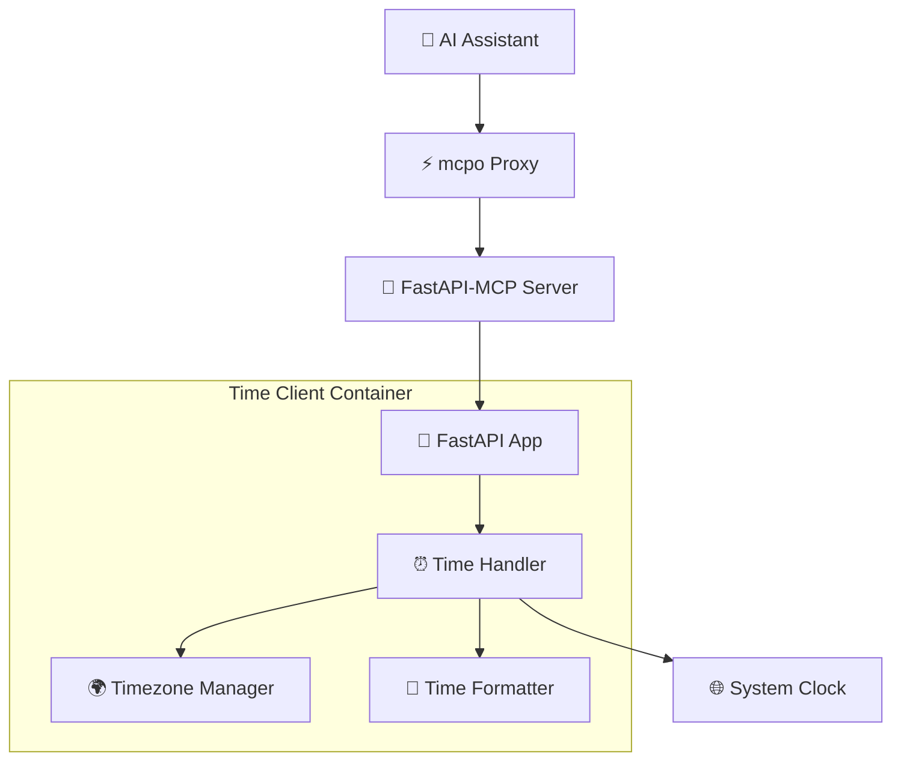

# ⏰ Time Client Service

A simple but powerful time-related MCP (Model Context Protocol) service for AI assistants with timezone support and formatting options.

## 🎯 Purpose

The Time Client service provides comprehensive time-related functionality for AI assistants through the MCP protocol. It enables AI models to query current time, work with timezones, and format time data according to user preferences.

## 🏗️ Architecture



## ⚡ Features

### 🔧 **Core Capabilities**
- **Current Time Queries**: Get current time in various formats
- **Timezone Support**: Work with timezones worldwide
- **Time Formatting**: Multiple output formats (ISO, human-readable, custom)
- **MCP Integration**: Native Model Context Protocol support
- **Fast Response**: Lightweight service with minimal overhead

### 🌍 **Timezone Features**
- **Global Timezone Support**: Access to all IANA timezone database
- **Timezone Conversion**: Convert time between different zones
- **Smart Defaults**: Sensible fallbacks for timezone operations
- **Timezone Discovery**: List and search available timezones

## 📡 API Endpoints

### **MCP Endpoints**
- `GET /mcp/sse` - Server-Sent Events MCP connection
- `POST /mcp` - Direct MCP tool calls

### **Direct FastAPI Endpoints**
- `GET /current_time` - Get current time
- `GET /timezones` - List available timezones
- `GET /health` - Health check
- `GET /docs` - Interactive API documentation

## 🔧 Tool Specifications

### `get_current_time`
Returns the current time in various formats.

**Parameters:**
- `timezone` (string, optional): Target timezone (default: "UTC")
- `format` (string, optional): Output format ("iso", "human", "timestamp") (default: "iso")

**Returns:**
- `current_time`: Formatted current time string
- `timezone`: Timezone used for the result
- `timestamp`: Unix timestamp
- `iso_format`: ISO 8601 formatted time
- `human_readable`: Human-friendly format

**Example:**
```python
{
  "timezone": "America/New_York",
  "format": "human"
}
```

**Response:**
```python
{
  "current_time": "December 20, 2024 at 3:45 PM EST",
  "timezone": "America/New_York",
  "timestamp": 1703087100,
  "iso_format": "2024-12-20T15:45:00-05:00",
  "human_readable": "December 20, 2024 at 3:45 PM EST"
}
```

### `set_timezone`
Sets the default timezone for subsequent operations.

**Parameters:**
- `timezone` (string, required): IANA timezone name

**Returns:**
- `success`: Boolean indicating successful timezone change
- `timezone`: The new default timezone
- `current_time`: Current time in the new timezone

### `list_timezones`
Returns a list of available timezones with optional filtering.

**Parameters:**
- `filter` (string, optional): Filter string to search timezone names
- `region` (string, optional): Filter by geographic region

**Returns:**
- `timezones`: List of timezone names
- `total_count`: Total number of matching timezones
- `regions`: Available geographic regions

## 🚀 Usage Examples

### Through MCP (AI Assistant)
```
User: "What time is it right now?"
AI: Uses get_current_time tool → "It's currently 2024-12-20T20:45:00Z UTC"

User: "What time is it in Tokyo?"
AI: Uses get_current_time with timezone="Asia/Tokyo" → "It's 5:45 AM JST in Tokyo"

User: "Show me all US timezones"
AI: Uses list_timezones with region="America" → Lists US/American timezones
```

### Direct API Calls
```bash
# Get current UTC time
curl "http://localhost:8003/current_time"

# Get current time in specific timezone
curl "http://localhost:8003/current_time?timezone=Europe/London&format=human"

# List all timezones
curl "http://localhost:8003/timezones"

# Search for specific timezones
curl "http://localhost:8003/timezones?filter=america"
```

## 🛠️ Configuration

### Environment Variables
- `DEFAULT_TIMEZONE=UTC` - Default timezone for operations
- `TIME_FORMAT=iso` - Default time format
- `LOG_LEVEL=INFO` - Logging level

### Supported Timezones
The service supports all IANA timezone database entries, including:
- **UTC/GMT**: Universal coordinated time
- **Americas**: America/New_York, America/Los_Angeles, America/Chicago, etc.
- **Europe**: Europe/London, Europe/Paris, Europe/Berlin, etc.
- **Asia**: Asia/Tokyo, Asia/Shanghai, Asia/Singapore, etc.
- **Africa**: Africa/Cairo, Africa/Johannesburg, etc.
- **Australia**: Australia/Sydney, Australia/Melbourne, etc.

### Time Formats
- **ISO**: ISO 8601 format (2024-12-20T20:45:00Z)
- **Human**: Human-readable format (December 20, 2024 at 8:45 PM UTC)
- **Timestamp**: Unix timestamp (1703087100)

## 📦 Dependencies

```txt
fastapi==0.104.1
fastapi-mcp==0.2.0
uvicorn==0.24.0
pydantic==2.5.0
pytz==2023.3
```

## 🔧 Development

### Local Setup
```bash
cd time-client/

# Create virtual environment
python -m venv venv
source venv/bin/activate  # Linux/Mac
# or: venv\Scripts\activate  # Windows

# Install dependencies
pip install -r requirements.txt

# Run the service
python app/main.py
```

### Docker Setup
```bash
# Build image
docker build -t time-client:latest .

# Run container
docker run -p 8003:8003 time-client:latest
```

### Testing
```bash
# Test health endpoint
curl http://localhost:8003/health

# Test current time
curl http://localhost:8003/current_time

# Test timezone listing
curl http://localhost:8003/timezones

# Test MCP integration
curl http://localhost:8003/mcp/sse
```

## 🔍 Monitoring & Logging

### Health Checks
The service provides health monitoring:
- Container health via `/health` endpoint
- Service availability checking
- Response time monitoring

### Logging
```python
# Request logging
logger.info(f"Time request for timezone: {timezone}")
logger.info(f"Returning time: {formatted_time}")

# Error logging
logger.error(f"Invalid timezone: {timezone}")
logger.warning(f"Timezone conversion failed: {error}")
```

### Metrics (Prometheus)
- `time_requests_total` - Total time requests by timezone
- `time_request_duration_seconds` - Request duration histogram
- `timezone_usage_total` - Timezone usage statistics
- `time_format_usage_total` - Format usage statistics

## 🌍 Timezone Handling

### Timezone Validation
```python
# Valid timezone examples
"UTC"
"America/New_York"
"Europe/London"
"Asia/Tokyo"
"Australia/Sydney"

# Invalid timezone examples (will fallback to UTC)
"EST"  # Ambiguous
"PST"  # Ambiguous
"GMT+5"  # Non-standard format
```

### Daylight Saving Time
The service automatically handles DST transitions:
- Uses pytz library for accurate DST calculations
- Automatically adjusts for local DST rules
- Provides DST status in detailed responses

### Timezone Conversion
```python
# Example: Convert current time to multiple zones
{
  "utc": "2024-12-20T20:45:00Z",
  "new_york": "2024-12-20T15:45:00-05:00",
  "london": "2024-12-20T20:45:00+00:00",
  "tokyo": "2024-12-21T05:45:00+09:00"
}
```

## 🔧 Troubleshooting

### Common Issues

**Invalid timezone error:**
```bash
# Check available timezones
curl http://localhost:8003/timezones?filter=your_zone

# Use exact IANA timezone name
{"timezone": "America/New_York"}  # Correct
{"timezone": "EST"}               # Incorrect
```

**Service not responding:**
```bash
# Check service health
curl http://localhost:8003/health

# Check container logs
docker logs <container_id>

# Restart container
docker restart <container_id>
```

**Time format issues:**
```bash
# Check supported formats
curl http://localhost:8003/docs

# Use valid format parameter
{"format": "iso"}     # Valid
{"format": "human"}   # Valid
{"format": "custom"}  # Invalid
```

### Debug Mode
```bash
# Run with debug logging
docker run -e LOG_LEVEL=DEBUG -p 8003:8003 time-client:latest
```

## 🔗 Integration

### With mcpo
The time client service is configured in mcpo via `mcpo-config.json`:
```json
{
  "mcpServers": {
    "time": {
      "type": "sse",
      "url": "http://time-client:8003/mcp/sse"
    }
  }
}
```

### With Open WebUI
Once configured through mcpo, the time tools are available in the Open WebUI chat interface for natural language time queries.

### Example Integration Flow
1. User asks: "What time is it in Paris?"
2. Open WebUI → mcpo → Time Client
3. Time Client processes timezone conversion
4. Returns formatted time to user via chat

## 📚 Related Documentation

- [FastAPI-MCP Documentation](https://github.com/modelcontextprotocol/fastapi-mcp)
- [Model Context Protocol Specification](https://modelcontextprotocol.io/)
- [IANA Time Zone Database](https://www.iana.org/time-zones)
- [Python pytz Documentation](https://pypi.org/project/pytz/)

## 🚀 Future Enhancements

### Planned Features
- **Time Zone Calculations**: Duration between times in different zones
- **Meeting Scheduler**: Find optimal meeting times across zones
- **Holiday Calendar**: Integration with holiday APIs
- **Time Reminders**: Schedule-based notifications
- **Historical Time**: Query time for specific dates

### API Extensions
- **Batch Operations**: Multiple timezone queries in one request
- **Time Arithmetic**: Add/subtract time periods
- **Calendar Integration**: Work with calendar systems
- **Localization**: Multi-language time formatting

---

**Note**: This service provides accurate time information using standard libraries and timezone databases. For mission-critical applications, consider using dedicated time synchronization services. 